# Artwork

Outside of machine learning and data, I paint and draw as a way to unplug and recharge. This page is a growing gallery of my work — click on any piece to view it in full size.

## Oil Paintings

```{=html}
<div class="art-gallery">
<figure><a href="art/paintings/paint_1-large.jpg" class="lightbox" data-gallery="paintings" title="Oil painting">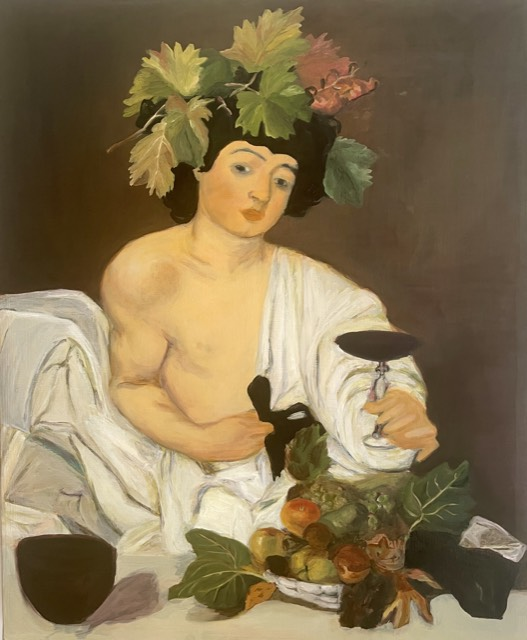</a></figure>
<figure><a href="art/paintings/paint_2-large.jpg" class="lightbox" data-gallery="paintings" title="Oil painting">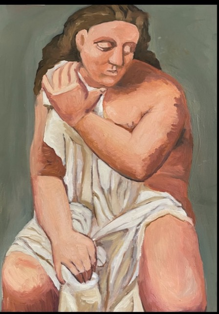</a></figure>
<figure><a href="art/paintings/paint_3-large.jpg" class="lightbox" data-gallery="paintings" title="Oil painting">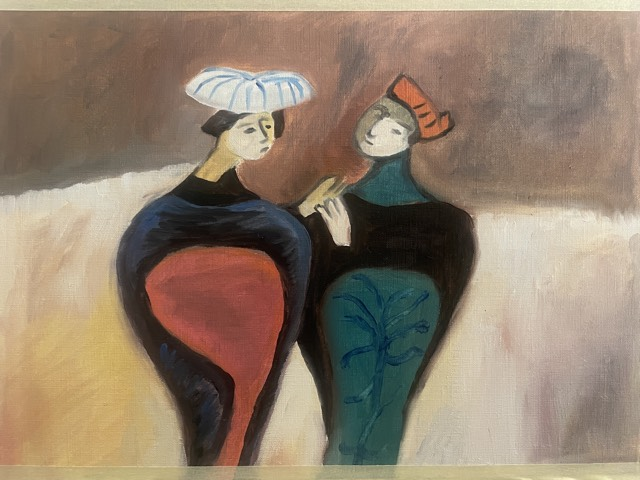</a></figure>
<figure><a href="art/paintings/paint_4-large.jpg" class="lightbox" data-gallery="paintings" title="Oil painting">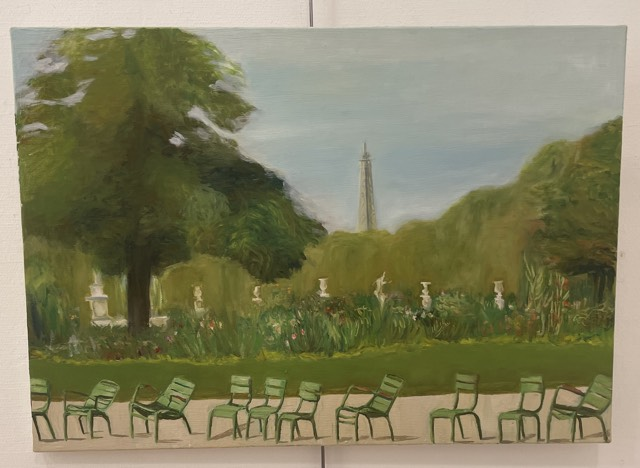</a></figure>
<figure><a href="art/paintings/paint_5-large.jpg" class="lightbox" data-gallery="paintings" title="Oil painting">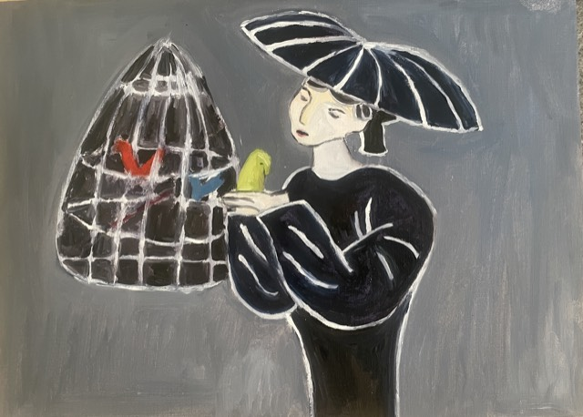</a></figure>
<figure><a href="art/paintings/paint_6-large.jpg" class="lightbox" data-gallery="paintings" title="Oil painting">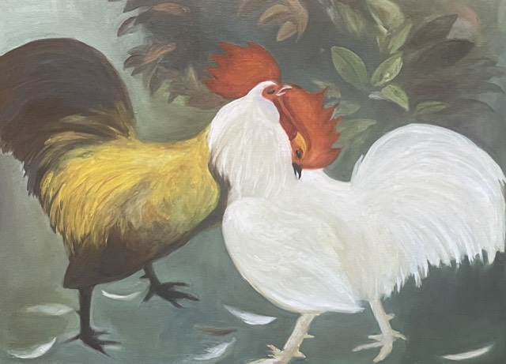</a></figure>
<figure><a href="art/paintings/paint_7-large.jpg" class="lightbox" data-gallery="paintings" title="Oil painting">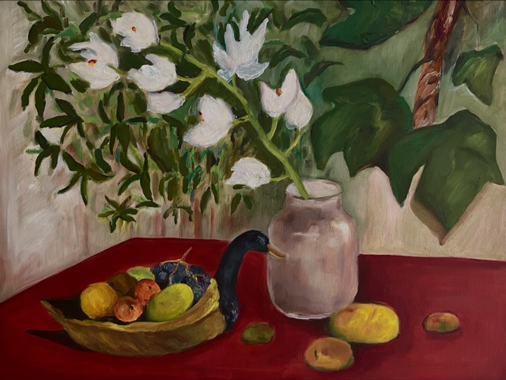</a></figure>
<figure><a href="art/paintings/paint_8-large.jpg" class="lightbox" data-gallery="paintings" title="Oil painting">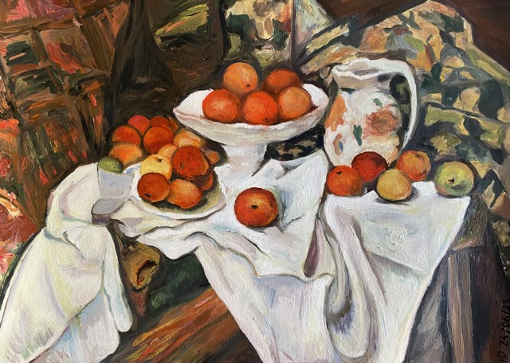</a></figure>
</div>
```

## Watercolor

```{=html}
<div class="art-gallery">
<figure><a href="art/drawings/water_1-large.jpg" class="lightbox" data-gallery="watercolor" title="Watercolor">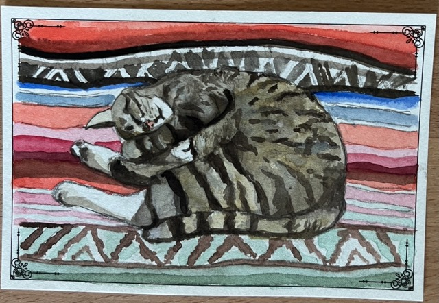</a></figure>
<figure><a href="art/drawings/water_2-large.jpg" class="lightbox" data-gallery="watercolor" title="Watercolor">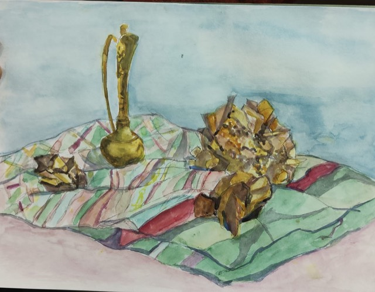</a></figure>
<figure><a href="art/drawings/water_3-large.jpg" class="lightbox" data-gallery="watercolor" title="Watercolor">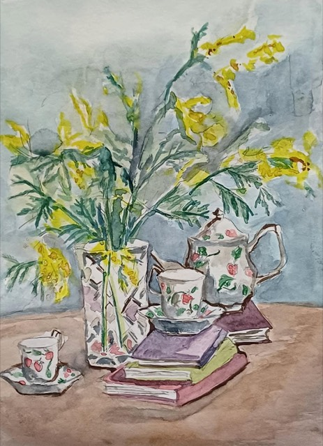</a></figure>
<figure><a href="art/drawings/water_4-large.jpg" class="lightbox" data-gallery="watercolor" title="Watercolor">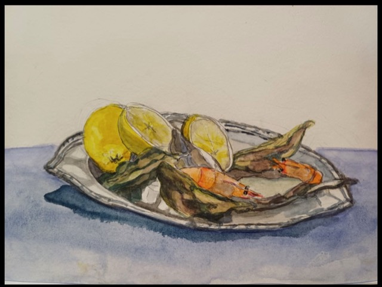</a></figure>
<figure><a href="art/drawings/water_5-large.jpg" class="lightbox" data-gallery="watercolor" title="Watercolor">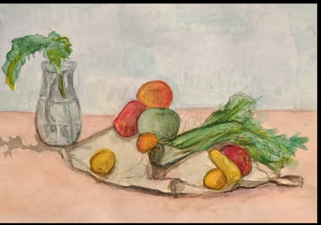</a></figure>
<figure><a href="art/drawings/water_6-large.jpg" class="lightbox" data-gallery="watercolor" title="Watercolor">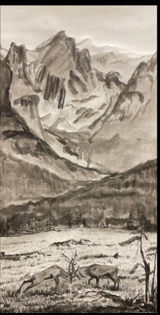</a></figure>
</div>
```
