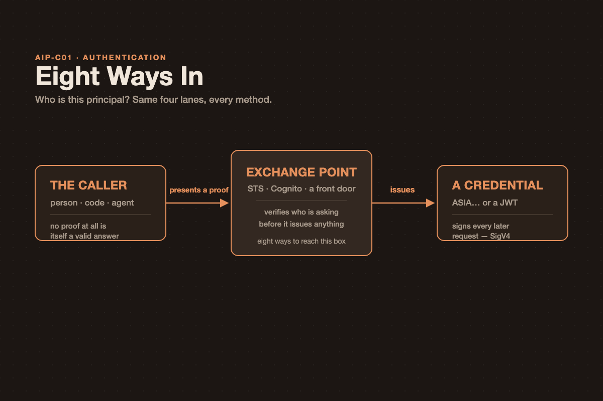

# Eight Ways In: Notes for AWS Certification

{.post-banner fig-alt="Eight Ways In — AWS authentication"}

Every AWS authentication method answers one question — **who is this principal?** Exam stems dress that question up eight different ways, and it's easy to end up pattern-matching on surface details (SAML vs. OIDC, a bearer token vs. a signature) instead of noticing that all eight methods share one shape. Once that shape is fixed, the only real work left is identifying who is calling.

## They Are All the Same Shape

Something proves who you are, something exchanges that proof, and you end up holding a credential you can sign requests with. The methods differ only in *what you present* and *who verifies it* — not in the underlying mechanics.

**The caller** (person, code, or agent) **presents a proof** — a secret, a signature, an assertion, a token, a certificate, or nothing at all — to an **exchange point** (STS, Cognito, or some other front door), which verifies it and **issues** a credential (a temporary `ASIA…` key or a JWT). That credential is what signs every later request — with SigV4, for AWS calls. Authentication ends the moment a principal exists; everything after that is authorization.

The part people skip is the return path: the credential goes back to the *caller*, and it's the caller's own subsequent requests that get signed with it — not some intermediary acting on their behalf.

## The Eight, Grouped by Who Is Calling

That's the fork to settle first, before touching any service name. Below, each method is described in the same terms: what it presents, what it gets back, and the one thing worth watching for.

### Group A — Your Workforce

**IAM Identity Center** (`AssumeRole` via a permission set) is how employees reach many AWS accounts from a corporate directory you already run.

- **Presents:** a SAML 2.0 assertion from your IdP (Okta, Entra ID) — or a password, if you use the built-in Identity Center directory.
- **Gets back:** a role session per account, plus short-term access keys from the access portal.
- **Instead of:** calling `AssumeRoleWithSAML` directly, which works but must be wired up in every account separately. Identity Center is one federation point for the whole organization.
- **Watch:** one identity source per organization. The SCIM provisioning token expires after a year, and provisioning then stops *silently*.

### Group B — Code Running on AWS

**The role on the compute** is the default for anything you run on AWS. If an answer stores a key here, it's the wrong answer.

- **Presents:** nothing — position is the proof. The SDK's default credential chain reads a local credential endpoint (IMDSv2 on EC2, the task metadata endpoint on ECS, the Pod Identity agent on EKS).
- **Gets back:** temporary credentials, rotated automatically. No configuration, no API call from your code.
- **On EKS:** Pod Identity is now AWS's recommendation over IRSA — one static trust principal instead of an OIDC provider per cluster, plus cluster/namespace session tags for ABAC.
- **Watch:** IRSA is still required for EKS Anywhere, ROSA, and self-managed Kubernetes — Pod Identity doesn't cover those.

**`AssumeRole`** (`sts:AssumeRole`) is for crossing an account boundary, or stepping down from broad credentials to narrow ones.

- **Presents:** credentials you already hold, plus the target role's ARN.
- **Gets back:** a session on the target role, 15 minutes up to that role's configured maximum.
- **Third parties:** add an `sts:ExternalId` condition to the trust policy — the standard fix for the confused-deputy problem when a vendor is assuming your role.
- **Watch:** the trust policy lives on the *target* role, in the target account — it's a resource policy, and it's what makes cross-account access possible at all. Role chaining (assuming a role using credentials that were themselves assumed) caps the session at **one hour**, no matter what the role's own maximum says.

### Group C — Code Running Outside AWS

**OIDC federation** (`sts:AssumeRoleWithWebIdentity`) is the modern default whenever a stem says "no stored credentials" — CI/CD pipelines, other clouds.

- **Presents:** a signed JWT from the platform's own OIDC issuer (GitHub Actions, GitLab).
- **Setup:** an IAM OIDC identity provider, plus a role whose trust policy pins the `sub` claim to a specific repository and branch.
- **Same call, underneath:** this is the same mechanism Cognito identity pools use, and what IRSA runs on internally.
- **Watch:** Google, Facebook, and Cognito already have built-in OIDC providers — creating a *new* one for them in a scenario is a distractor.

**IAM Roles Anywhere** (`rolesanywhere:CreateSession`) is for on-premises servers — listen for "our own PKI" or "certificates" in the same sentence as "data centre".

- **Presents:** a request signed with an X.509 private key, via the `aws_signing_helper`.
- **Three objects, all Regional, all in one account:** a trust anchor (your registered CA), a profile, and a role.
- **Gets back:** temporary credentials, 15 minutes to 12 hours, with the certificate's subject and issuer fields attached as session tags — your PKI becomes an attribute source you can write IAM conditions against.
- **Watch:** any certificate from any trust anchor in the account can assume any role there, unless the trust policy narrows it. Revocation is by imported CRL only — there's no OCSP.

### Group D — Users of Your Application

**Cognito user pool** (returns JWTs — authentication only) is for consumer sign-up and sign-in, and very often *is* the whole answer, with no identity pool involved at all.

- **Presents:** whatever you enable — password, passkey, email/SMS one-time code, or a federated login.
- **Gets back:** ID and access tokens (5 minutes to 1 day) and a refresh token (30 days by default, up to 10 years).
- **Tiers matter:** passkeys and managed login require the Essentials tier; threat protection requires Plus. The Lite tier only gets the old hosted UI.
- **Watch:** MFA and custom auth flows are unavailable to *federated* users — a common gotcha when a scenario mixes social login with an MFA requirement.

**Cognito identity pool** (exchanges a token for AWS credentials) gets added *only* when the client itself must call an AWS API directly. The difference from the card above is exactly one lane in the flow.

- **Presents:** a user pool token, a third-party IdP token, a developer-authenticated identity — or nothing at all, for guest access.
- **Gets back:** temporary AWS credentials on a mapped IAM role.
- **Role mapping:** a default role, rules matching a token claim, or the `cognito:preferred_role` claim from a group.
- **Watch:** bolting one onto an architecture where your backend *already* calls AWS on the user's behalf is pure cost and complexity for nothing.

### Group E — Agents and Model Callers

**Bearer tokens and agent identity** (Bedrock API keys, AgentCore Identity) is where this exam actually tests authentication in an agentic context — and the key idea is that an agent has *two* identities: who called it, and who it calls out *as*.

- **Inbound:** one AgentCore Runtime version accepts SigV4 *or* a JWT authorizer — never both at once; configure separate versions if you need both paths. A JWT configuration needs a discovery URL plus at least one of: allowed audiences, clients, scopes, or custom claims. An AgentCore Gateway adds two more modes on top: `AUTHENTICATE_ONLY` and `NONE`.
- **Outbound:** three patterns for calling out on the user's behalf — **2LO** (client credentials, machine-to-machine), **3LO** (authorization code with one-time user consent), and **OBO** (token exchange, swapping the inbound user token for a downstream one with no extra consent — the recommended production pattern).
- **Bedrock API keys:** a bearer token carried in `AWS_BEARER_TOKEN_BEDROCK`, for frameworks that only understand "an API key". Short-term keys inherit your session, last at most 12 hours, work only in the Region that generated them, and are the production form. Long-term keys create a dedicated IAM user and exist for exploration only.
- **Watch:** blocking long-term keys requires denying *both* `bedrock:CallWithBearerToken` and `bedrock-mantle:CallWithBearerToken` — missing either one leaves a gap. Short-term key generation itself cannot be prevented at all.

### And One More — the Method You Should Not Reach For

**IAM user access keys** (`AKIA…`, long-term) are worth knowing precisely *because* they're the distractor in so many questions.

- **Presents:** a permanent access key and secret, signed with SigV4 directly.
- **Still legitimately valid for:** workloads that genuinely cannot use roles, and service-specific credentials (CodeCommit, Keyspaces).
- **The tell:** `ASIA…` is temporary and came from STS. `AKIA…` is long-term and came from an IAM user — that four-letter prefix is worth memorizing on its own.
- **Watch:** notice what's *missing* from this flow compared to every other method — no exchange, no expiry, no third party attesting anything. The secret is the entire proof, and AWS's own documentation now marks long-term keys "(Not recommended)" for programmatic access.

## Compared

The last column is what to actually listen for. Exam stems rarely name the service outright — they name the constraint.

| Method | Who calls | Presents | Gets back | Lifetime | The tell in the stem |
|---|---|---|---|---|---|
| IAM Identity Center | Employees | SAML assertion | Role session per account | 1–12 h | "many accounts", "existing corporate IdP" |
| Role on the compute | Your code on AWS | Nothing — position is the proof | Auto-rotated credentials | auto | anything running on EC2, Lambda, ECS, EKS |
| `AssumeRole` | An existing principal | Credentials + role ARN | Session on another role | 15 m–12 h (1 h if chained) | "cross-account", "a third-party vendor" |
| OIDC federation | Code outside AWS | A signed JWT | Temporary credentials | 1 h default | "CI/CD", "no stored credentials" |
| Roles Anywhere | Servers outside AWS | X.509 signature | Temporary credentials + cert tags | 15 m–12 h | "on-premises", "our own PKI" |
| Cognito user pool | Your app's users | Password, passkey, OTP, federation | ID, access, refresh JWTs | 5 m–1 day, refresh ≤10 y | "sign-up and sign-in", "mobile users" |
| Cognito identity pool | Your app's users | A token, or nothing | AWS credentials on a role | ≤1 h | "upload directly to S3", "from the browser" |
| Bearer token / agent | An agent or framework | Bedrock API key, or a JWT | A validated caller | ≤12 h, or the token's `exp` | "only accepts an API key", "on the user's behalf" |
| IAM user access key | Anything | A permanent secret | Full user permissions | until rotated | almost always the distractor |

**The one line to remember:** seven of the nine end in temporary credentials from STS. Cognito user pools end in a JWT your own code verifies, and access keys end in nothing new at all — no exchange happened. If you can say which of those three endings a scenario needs, you've already picked the method.

## How to Choose, in One Question

Settle *who is calling* first — nothing downstream can be reached without answering that. Then one follow-up question settles it:

| Who is calling | Follow-up question | Answer |
|---|---|---|
| An employee | Many accounts, or one? | **IAM Identity Center** for many · `AssumeRoleWithSAML` for one |
| Code on AWS | Same account, or another? | **The role on the compute** for same · **`AssumeRole`** (+ `ExternalId` for vendors) for another |
| Code outside AWS | Does it hold an OIDC token, or a certificate? | **OIDC federation** for a token · **IAM Roles Anywhere** for a certificate |
| A user of your app | Does your backend call AWS, or does the client? | **User pool alone** if your backend does · **add an identity pool** if the client does |
| An agent | Inbound, or outbound? | Inbound is **SigV4 or JWT, never both** · outbound is the **execution role inside AWS**, the **token vault outside** |

Picking the method before identifying the caller is how these questions get missed — every branch above takes exactly two questions, in that order.

## Sources

Every figure, limit, and behaviour above was read from AWS's own documentation.

- [What is IAM Identity Center](https://docs.aws.amazon.com/singlesignon/latest/userguide/what-is.html) · [Identity sources](https://docs.aws.amazon.com/singlesignon/latest/userguide/manage-your-identity-source.html) · [SCIM provisioning](https://docs.aws.amazon.com/singlesignon/latest/userguide/provision-automatically.html)
- [Pod Identity vs. IRSA](https://docs.aws.amazon.com/eks/latest/userguide/service-accounts.html) · [EKS Pod Identity](https://docs.aws.amazon.com/eks/latest/userguide/pod-identities.html) · [IRSA](https://docs.aws.amazon.com/eks/latest/userguide/iam-roles-for-service-accounts.html)
- [STS API operations](https://docs.aws.amazon.com/STS/latest/APIReference/API_Operations.html) · [Credential comparison](https://docs.aws.amazon.com/IAM/latest/UserGuide/id_credentials_sts-comparison.html) · [Methods to assume a role](https://docs.aws.amazon.com/IAM/latest/UserGuide/id_roles_manage-assume.html)
- [OIDC federation](https://docs.aws.amazon.com/IAM/latest/UserGuide/id_roles_providers_oidc.html) · [Creating an OIDC provider](https://docs.aws.amazon.com/IAM/latest/UserGuide/id_roles_providers_create_oidc.html) · [SAML 2.0 federation](https://docs.aws.amazon.com/IAM/latest/UserGuide/id_roles_providers_saml.html)
- [IAM Roles Anywhere — introduction](https://docs.aws.amazon.com/rolesanywhere/latest/userguide/introduction.html) · [Trust model](https://docs.aws.amazon.com/rolesanywhere/latest/userguide/trust-model.html) · [Credential helper](https://docs.aws.amazon.com/rolesanywhere/latest/userguide/credential-helper.html)
- [What is Amazon Cognito](https://docs.aws.amazon.com/cognito/latest/developerguide/what-is-amazon-cognito.html) · [Identity pools](https://docs.aws.amazon.com/cognito/latest/developerguide/identity-pools.html) · [Feature plans](https://docs.aws.amazon.com/cognito/latest/developerguide/cognito-sign-in-feature-plans.html) · [Token lifetimes](https://docs.aws.amazon.com/cognito/latest/developerguide/amazon-cognito-user-pools-using-the-refresh-token.html)
- [Bedrock API keys](https://docs.aws.amazon.com/bedrock/latest/userguide/api-keys.html) · [Governing API keys](https://docs.aws.amazon.com/bedrock/latest/userguide/api-keys-permissions.html) · [AgentCore Runtime inbound auth](https://docs.aws.amazon.com/bedrock-agentcore/latest/devguide/runtime-oauth.html) · [AgentCore outbound credential providers](https://docs.aws.amazon.com/bedrock-agentcore/latest/devguide/identity-outbound-credential-provider.html)
- [Comparing IAM identities and credentials](https://docs.aws.amazon.com/IAM/latest/UserGuide/introduction_identity-management.html) · [Multi-factor authentication](https://docs.aws.amazon.com/IAM/latest/UserGuide/id_credentials_mfa.html)
