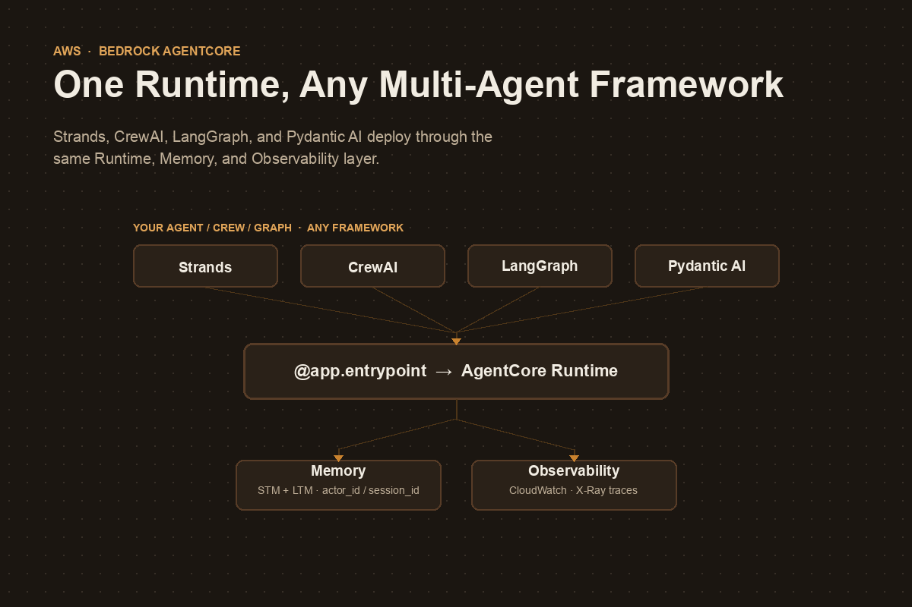

# Bedrock AgentCore: One Runtime, Any Multi-Agent Framework

{.post-banner fig-alt="Bedrock AgentCore multi-agent deployment"}

A multi-agent system that works on a laptop and one that survives production are two different engineering problems. The laptop version is a script: a crew, a swarm, or a graph that runs to completion and exits. The production version needs session isolation between users, memory that survives a container restart, secure sandboxes for code the LLM writes, and enough observability to answer "why did agent B never get the handoff from agent A?" at 2 a.m.

Building that infrastructure yourself, per framework, is months of work you didn't sign up for. **Amazon Bedrock AgentCore** exists to make that infrastructure a managed layer instead — and its most useful property is that it does not care which orchestration framework produced your agents. Strands Swarms, CrewAI crews, LangGraph graphs, and Pydantic AI agents all deploy through the *same* entrypoint, the *same* memory service, and the *same* observability dashboard.

This post walks through what AgentCore actually is, the one decorator that makes any agent — single or multi — deployable, and how the shared services (Memory, Runtime, Observability) let a multi-framework organization standardize on infrastructure without standardizing on a framework.

## What AgentCore actually is

AgentCore is not one product — it's a set of independent services you can use separately or together:

| Service | Purpose | When to use it |
|---|---|---|
| **Runtime** | Managed hosting for AI agents | Deploy any agent for automatic scaling and observability |
| **Memory** | Persistent conversation storage + fact extraction | Need conversation history or cross-session preferences |
| **Gateway** | Managed hosting for MCP tools | Connect agents to existing business systems and APIs |
| **Code Interpreter** | Secure Python sandbox with pre-installed libraries | Agent needs calculations, data analysis, or charts |
| **Browser Tool** | Secure, cloud-based browser for agents | Web scraping, automated testing, legacy UI integration |
| **Identity** | Identity and access management for agents | Agents acting on behalf of a specific authenticated user |
| **Observability** | Monitoring and debugging for agent workflows | Need visibility into performance and failures |

You reach these services through three layers, each a different level of abstraction:

1. **Control Plane / Data Plane APIs** — raw `boto3` access, maximum control, minimum convenience.
2. **AgentCore SDK** — Python helpers (`BedrockAgentCoreApp`, memory config classes, session managers) that you import directly into agent code.
3. **Starter Toolkit / CLI** — `agentcore configure`, `agentcore launch`, `agentcore invoke`, `agentcore status`, `agentcore destroy`. This is what automates containerization, ECR, IAM roles, and wiring the services together.

Almost everything in this post uses layers 2 and 3.

## The one decorator that deploys anything

The entire integration surface between "local script" and "production agent" is one decorator:

```python
from bedrock_agentcore.runtime import BedrockAgentCoreApp

app = BedrockAgentCoreApp()

@app.entrypoint
def invoke(payload, context):
    """AgentCore Runtime entry point"""
    result = my_agent(payload.get("prompt", "Hello!"))
    return {"response": result}

if __name__ == "__main__":
    app.run()
```

`payload` carries the request, `context` carries session/actor headers and the AgentCore session ID. Everything inside `invoke()` is yours — a single Strands `Agent`, a CrewAI `crew().kickoff()`, or a compiled LangGraph graph's `.invoke()`. AgentCore doesn't inspect what's inside the function; it just needs something that takes a payload and returns a result.

Deployment is the same three commands regardless of what's inside:

```bash
uv run agentcore configure -e agent_deployment/agent.py   # wire up IAM, ECR, memory
uv run agentcore launch                                    # build container, deploy
uv run agentcore invoke '{"prompt": "..."}'                 # test the live endpoint
```

`agentcore launch --local` runs the same container on your machine first, so you're not debugging Docker and AWS IAM at the same time.

## The same pattern, three frameworks

Because the entrypoint contract is just "function in, JSON out," the framework-specific code only changes what happens *inside* `invoke()`.

**CrewAI** — a multi-agent crew becomes one entrypoint call:

```python
from bedrock_agentcore import BedrockAgentCoreApp

app = BedrockAgentCoreApp()

@app.entrypoint
def invoke(payload, context=None) -> str:
    result = AgentcoreCrewAi().crew().kickoff(inputs=payload)
    return result.raw
```

Two agents — a Researcher and a Reporting Analyst, each with a role, goal, and backstory defined in YAML — run through `Process.sequential` inside that single call. AgentCore never sees the handoff between them; it only sees one request and one response.

**LangGraph** — a compiled state graph, invoked the same way:

```python
from typing import Annotated, TypedDict
from langgraph.graph.message import add_messages

class State(TypedDict):
    messages: Annotated[list, add_messages]

@app.entrypoint
def invoke(payload, context=None):
    enhanced = f"{get_memory_context(context)}\n\nCurrent user message: {payload['prompt']}"
    result = graph.invoke({"messages": [("user", enhanced)]})
    store_conversation(context, payload["prompt"], result)  # store the raw prompt, not the enhanced one
    return {"response": result["messages"][-1].content}
```

Note the detail that will bite you if you skip it: you enhance the *outgoing* prompt with retrieved memory context, but you store the *original* prompt back to Memory. Store the enhanced version instead and each turn's memory retrieval compounds into the next, until your context window is mostly recycled memory.

**Strands** — a `Swarm` or `Graph` instead of a single `Agent`, same decorator:

```python
from strands.multiagent import Swarm

@app.entrypoint
def invoke(payload, context=None):
    swarm = Swarm([researcher, coder, reviewer], entry_point=researcher, max_handoffs=20)
    result = swarm(payload.get("prompt", "Hello!"))
    return {"response": str(result)}
```

The multi-agent complexity — swarm handoffs, graph edges, crew roles, LangGraph conditional routing — is entirely internal to the framework you picked. AgentCore's job stops at the function boundary. That's the whole point: **the deployment story doesn't change when the orchestration story gets more complicated.**

## Memory: the one service every framework shares

The most concrete evidence that AgentCore is framework-agnostic is that the same `MemoryManager` pattern is reported to work unchanged across CrewAI, Strands, Pydantic AI, LlamaIndex, and LangGraph in AWS's own multi-framework example series. Memory has two tiers:

- **Short-term memory (STM)** — exact conversation history, keyed by session, survives container restarts.
- **Long-term memory (LTM)** — facts and preferences extracted *across* sessions, keyed by actor (user), retrieved by semantic relevance.

For frameworks with native session-manager hooks (Strands), it looks like this:

```python
from bedrock_agentcore.memory.integrations.strands.config import AgentCoreMemoryConfig, RetrievalConfig
from bedrock_agentcore.memory.integrations.strands.session_manager import AgentCoreMemorySessionManager

memory_config = AgentCoreMemoryConfig(
    memory_id=MEMORY_ID,
    session_id=session_id,
    actor_id=actor_id,
    retrieval_config={
        f"/users/{actor_id}/facts": RetrievalConfig(top_k=3, relevance_score=0.5),
        f"/users/{actor_id}/preferences": RetrievalConfig(top_k=3, relevance_score=0.5),
    },
)
agent = Agent(session_manager=AgentCoreMemorySessionManager(memory_config, REGION), ...)
```

For frameworks without that hook (CrewAI, LangGraph, Pydantic AI, LlamaIndex), you call the Memory data-plane API directly at the top and bottom of `invoke()`: retrieve relevant memories before the call, store the turn after it. Same service, same `actor_id`/`session_id` keys, different amount of framework glue.

## Why every example uses lazy agent creation

Almost every AgentCore tutorial builds the agent inside a `get_or_create_agent()` function guarded by a module-level `None`, instead of at import time. This isn't boilerplate — it's forced by how Runtime actually schedules work:

- Each **session ID** gets its own dedicated container, alive for up to 8 hours or 15 minutes of inactivity.
- `actor_id` and `session_id` are only known once a request arrives — not at container start.
- Memory configuration needs both before it can be constructed.
- You want to build the agent/crew/graph exactly once per container and reuse it for every subsequent invocation in that session.

```python
_agent = None

def get_or_create_agent(actor_id, session_id):
    global _agent
    if _agent is None:
        _agent = Agent(session_manager=AgentCoreMemorySessionManager(
            AgentCoreMemoryConfig(memory_id=MEMORY_ID, session_id=session_id, actor_id=actor_id),
            REGION,
        ))
    return _agent
```

This is also why session IDs must be 33+ characters: they're not just a lookup key, they're what AgentCore uses to route a request to a dedicated, isolated container and scope every memory operation. Short or predictable session IDs are a session-hijacking surface.

## Deployment lifecycle, at a glance

| Command | What it does |
|---|---|
| `agentcore configure -e agent.py` | Interactive setup: IAM role, ECR repo, memory (STM/LTM), pyproject.toml |
| `agentcore launch --local` | Builds and runs the container locally for testing |
| `agentcore launch` | Deploys to AgentCore Runtime on AWS |
| `agentcore invoke '{"prompt": "..."}'` | Calls the live endpoint |
| `agentcore status` | Shows endpoint ARN, memory status (color-coded), observability dashboard URL |
| `agentcore destroy` | Tears down Runtime, Memory, ECR, IAM roles, log groups |

For invoking from an actual application rather than the CLI, it's plain `boto3`:

```python
client = boto3.client("bedrock-agentcore", region_name="us-west-2")
response = client.invoke_agent_runtime(
    agentRuntimeArn=agent_arn,
    runtimeSessionId="production_session_2026_user456_webapp_xyz123",  # 33+ chars
    payload=b'{"prompt": "What is 25 * 4 + 10?"}',
)
```

No SDK-specific client, no framework detection — it's the same call whether the agent behind that ARN is a single Strands agent or a five-node LangGraph graph.

## Observability doesn't need extra wiring

`agentcore launch` enables a CloudWatch GenAI Observability dashboard automatically — no separate instrumentation step. It gives you a service map (agent → Memory → Code Interpreter → model calls), request-level latency/throughput/error metrics, and X-Ray traces you can drill into for individual invocations, memory retrievals, and tool executions. For a multi-agent system, this matters more than for a single agent: it's the difference between "the crew produced a wrong answer" and "the Researcher agent's tool call timed out and the Reporting Analyst silently continued with a partial result."

## The traps

**Flat-layout packaging errors on `agentcore launch`.** If your agent code and its supporting modules sit directly in the deployment folder instead of a `src/` layout, setuptools' build backend can refuse with "Multiple top-level modules discovered in a flat-layout." Structure the deployment package properly rather than fighting the build backend.

**Storing the memory-enhanced prompt instead of the original.** Covered above, but worth repeating: enhance the outgoing prompt with retrieved context, persist the original. Otherwise each retrieved memory becomes part of the next memory.

**Skipping the memory prompts during `configure`.** If you answer "no" to long-term memory extraction, or pick an existing memory resource instead of letting the toolkit create a new one, you'll need to reconfigure — and an existing memory resource isn't cleaned up by `agentcore destroy` the way an auto-created one is.

**Library import paths move.** `bedrock_agentcore`, `bedrock-agentcore-starter-toolkit`, and framework-specific integration packages (`strands-agents-tools[agent_core_code_interpreter]`, etc.) are young enough that import paths for things like the Code Interpreter tool have already shifted between releases. Pin versions and check the changelog before copying tutorial code verbatim.

## So when does this actually matter?

If you're deploying one agent, in one framework, for one team — AgentCore is still worth it for Runtime's session isolation and Observability alone, but you could plausibly build a thinner version yourself.

The case gets much stronger the moment you have **multiple teams choosing different frameworks** — one team on CrewAI because they think in roles, another on LangGraph because they need custom state reducers, another on Strands because they want Swarm's built-in handoff safety rails. Standardizing Memory, Identity, and Observability at the AgentCore layer means that choice stays a *team-level* decision instead of an *organization-level* one, without anyone losing production-grade infrastructure for picking the "wrong" framework.

---

*Sources: Mike Chambers' [Turn Your AI Script into a Production-Ready Agent](https://builder.aws.com/content/33duot88gLusLRgJkalulTJLUrx/turn-your-ai-script-into-a-production-ready-agent) on AWS Builder Center, and the [Building Production-Ready AI Agents](https://dev.to/aws/building-production-ready-ai-agents-a-multi-framework-journey-with-amazon-bedrock-agentcore-p32) multi-framework series on dev.to (Strands, CrewAI, Pydantic AI, LlamaIndex, and LangGraph parts), with code from AWS's [agentcore-multi-framework-examples](https://github.com/danilop/agentcore-multi-framework-examples) repository. AgentCore's CLI and SDK are evolving quickly — check version numbers before copying commands.*
