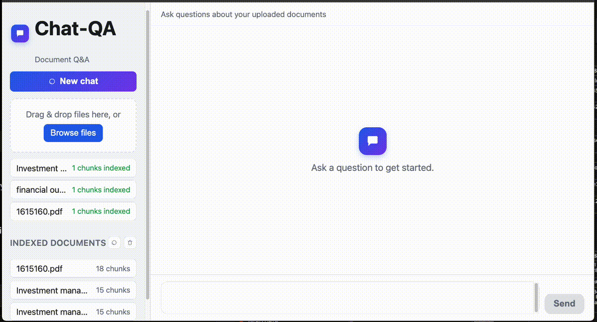

# A Local-First RAG Chat App, Built to Migrate to AWS on Day One

{.post-banner fig-alt="Chat retrieval system demo - upload a document, ask questions, get cited answers"}

Most "local-first" RAG prototypes push the AWS migration to a rewrite: local embeddings become Bedrock calls, a FAISS index becomes OpenSearch, and half the retrieval code changes shape along the way. This project - a chat-QA prototype built around the finance split of [UniDoc-Bench](https://huggingface.co/datasets/Salesforce/UniDoc-Bench) - takes the opposite approach: **Bedrock is the LLM and embedding provider from the first commit**, and only the storage layer is a local stand-in. Migrating later is a config and infrastructure change, not a code change.

## The Trick: Swap Storage, Not the API Calls

The design constraint is simple - pick local replacements for AWS services that implement the *same interface* the AWS service would, so nothing upstream of storage needs to know which one it's talking to.

| Concern | Local prototype | AWS target | What changes |
|---|---|---|---|
| LLM + embeddings | Bedrock (Claude Sonnet 4.5, Titan Embed v2) | Bedrock (same) | Nothing |
| Vector store | Chroma, persisted on disk | OpenSearch Serverless | Swap the body of one function |
| Document storage | Local disk | S3 | Swap `storage_dir` for a bucket |
| Chat session history | In-memory dict | DynamoDB | Add a table, swap the dict |
| Backend hosting | `uvicorn --reload` | ECS Fargate behind an ALB | Same Dockerfile either way |
| Frontend hosting | `python -m http.server` | S3 + CloudFront | Just hosting, no code |

The reason this works: `indexer.py`'s retrieval and indexing functions depend on LlamaIndex's `VectorStore` interface, never on Chroma directly.

```python
@lru_cache
def get_vector_store() -> ChromaVectorStore:
    client = chromadb.PersistentClient(path=setting.chroma_dir)
    collection = client.get_or_create_collection(setting.chroma_collection)
    return ChromaVectorStore(chroma_collection=collection)
```

Swapping this one function for `OpensearchVectorStore` pointed at a real collection is the entire vector-store migration - `build_or_update_index`, `retrieve`, `list_documents`, and every router that calls them stay untouched.

## Architecture

```
backend/app/
  src/
    docling_parser.py   # file bytes -> markdown (PDF/DOCX/PPTX/HTML/MD/TXT/XLSX)
    document_parser.py  # markdown -> llama_index Documents
    indexer.py           # chunk + embed + Chroma, chunk/doc listing
    chat_agent.py         # RAG chat agent (tool-calling) with per-session history
    llm_model.py           # Bedrock LLM + embedding model
  router/
    route_chat.py          # POST /chat, POST /chat/{session_id}/reset
    route_upload.py         # /documents endpoints
frontend/
  index.html, app.js, style.css   # plain HTML/JS chat UI, no build step
```

A separate `ingestion/` module (loaders, chunking, metadata, preprocessors, parser, storage) exists alongside the backend for offline experimentation - comparing a deterministic Docling parse against an LLM-assisted parse on the same documents, to see which produces better chunk boundaries before that choice gets baked into the live pipeline.

## Retrieval Is a Tool Call, Not a Pipeline Step

Rather than always retrieving before answering, the chat agent gives the LLM a `search_documents` tool and lets it decide when a question actually needs the document collection:

```python
def _make_search_tool(retrieved_sink: list) -> FunctionTool:
    def search_documents(query: str) -> str:
        nodes = retrieve(query)
        retrieved_sink.extend(nodes)
        if not nodes:
            return "No relevant documents found."
        return "\n\n---\n\n".join(
            f"[{n.node.metadata.get('filename', 'unknown')}]\n{n.node.get_content()}"
            for n in nodes
        )

    return FunctionTool.from_defaults(
        fn=search_documents,
        name="search_documents",
        description=(
            "Search the uploaded document collection for passages relevant to a "
            "query. Use this only when the question requires specific information "
            "from the documents. Do not use it for greetings or general questions."
        ),
    )
```

`answer_question` then runs a bounded tool-calling loop (`MAX_TOOL_ROUNDS = 4`) against Claude via Bedrock: call the LLM with the tool available, execute any tool calls it makes, feed the results back into history, and repeat until it answers with plain text instead of another tool call. Every retrieved node gets deduplicated and mapped back to its source chunk's position in the original document, so the response can cite `filename` + `chunk_number` rather than a bare similarity score.

This matters for a chat-shaped Q&A app specifically: "hi" or "what can you do?" shouldn't trigger a vector search, and a tool-calling agent gets that for free - a fixed retrieve-then-generate pipeline would either search on everything or need its own intent classifier.

## Chunking and Indexing

Ingestion runs through a `SentenceSplitter` before embedding, with sizes tuned for finance-document retrieval:

```python
splitter = SentenceSplitter(
    chunk_size=setting.chunk_size,      # 512
    chunk_overlap=setting.chunk_overlap,  # 64
)
index = VectorStoreIndex.from_documents(
    documents,
    storage_context=_storage_context(),
    embed_model=get_embedding_model(),
    transformations=[splitter],
)
```

Each chunk's `start_char_idx` gets persisted in Chroma's metadata (via LlamaIndex's `_node_content`), which is what lets `get_chunk_order` reconstruct source-order chunk numbers after the fact - Chroma itself has no native concept of document order, so this is the small amount of bookkeeping needed to answer "which chunk of the document was this."

## Retrieval Algorithms: What `retrieve()` Is Actually Doing

`retrieve(query)` looks like one function call, but it's hiding a choice of search algorithm that matters a lot more once the collection is millions of chunks instead of a few hundred. Worth being explicit about what Chroma is doing under the hood, and why that choice travels (or doesn't) to OpenSearch on the AWS side.

**Dense retrieval - what this app actually uses.** The query gets embedded with Titan Embed v2 into the same vector space as every chunk, and retrieval is "find the $k$ chunk vectors closest to the query vector," by cosine or dot-product distance. Brute-force nearest neighbor is $O(n)$ per query - fine for a demo, not fine once $n$ is millions of chunks - so real vector stores trade exactness for speed with **Approximate Nearest Neighbor (ANN)** search. Two algorithms dominate:

| | IVF (Inverted File Index) | HNSW (Hierarchical Navigable Small World) |
|---|---|---|
| Idea | Cluster vectors with k-means, only search the nearest clusters | Build a multi-layer proximity graph, walk it greedily toward the query |
| Build cost | Cheap - just k-means once | Expensive - inserts one node at a time, wiring graph edges |
| Query cost | Low, scales with clusters searched | Low, scales with graph hops, generally better recall/speed than IVF at the same memory budget |
| Memory | Compact (often paired with product quantization, "IVF-PQ") | Higher - the graph itself takes space |
| Key tunables | `nlist` (cluster count), `nprobe` (clusters searched per query) | `M` (max neighbors per node), `ef_construction` (build-time search width), `ef_search` (query-time search width) |

IVF's algorithm is the more intuitive of the two: partition all vectors into `nlist` clusters (k-means centroids) at index-build time, then at query time compare the query only against the `nprobe` closest cluster centroids and search within those - skip the rest of the index entirely. `nprobe = 1` is fast and lossy (misses neighbors in adjacent clusters near the boundary), `nprobe = nlist` degrades back to brute force.

HNSW instead builds layered graphs where the top layer has few nodes and long-range edges (fast coarse navigation, like an express lane) and each layer down adds more nodes and shorter edges, bottoming out at a graph over every vector:

```
layer 2:  o ─────────────── o ──────────── o        (few nodes, long edges)
layer 1:  o ──── o ──── o ──── o ──── o ──── o       (more nodes, shorter edges)
layer 0:  o──o──o──o──o──o──o──o──o──o──o──o──o──o   (every vector, local edges)
```

A query enters at the top layer, greedily walks toward the nearest node, drops a layer, and repeats - each layer narrows the search before the next one refines it, which is why HNSW query latency grows roughly logarithmically with collection size instead of linearly. Chroma's default index is HNSW (via `hnswlib`), which is what `retrieve()` in this app is actually calling underneath `ChromaVectorStore.query()`.

**Sparse retrieval - the alternative this app doesn't use, yet.** BM25 (and older TF-IDF) score documents by *lexical* overlap - shared terms, weighted by how rare and how densely they appear - via an inverted index rather than a vector index. It has no notion of "vehicle" matching "car"; what it's excellent at is exact terms dense embeddings often blur past - a specific ticker symbol, an invoice number, a rare technical acronym in these finance PDFs. Newer **learned sparse** methods (SPLADE is the reference one) sit in between: a transformer still produces the representation, but the output is a sparse, term-weighted vector, so it keeps an inverted index's exact-match precision with some of a dense model's semantic generalization.

| | Dense (this app: Chroma + HNSW) | Sparse (BM25 / TF-IDF) | Learned sparse (SPLADE) |
|---|---|---|---|
| Matches on | Semantic similarity | Shared terms | Term-weighted expansion |
| Structure | Vector index (IVF/HNSW/...) | Inverted index | Inverted index |
| Strong at | Paraphrase, "meaning" queries | Exact terms, IDs, acronyms | Both, at extra inference cost |
| Blind spot | Rare/exact terms it wasn't trained to distinguish | Synonyms, paraphrase | Still needs a model at index+query time |

The two are complementary rather than competing, which is why production RAG systems increasingly run both and fuse the results - typically with **Reciprocal Rank Fusion (RRF)**, which combines two ranked lists by each item's rank position rather than trying to reconcile two differently-scaled similarity scores. This app is dense-only today (a single `search_documents` tool call against Chroma), which is a reasonable place to start and a real gap for exact-match queries like "what's invoice #4471" - a natural next iteration once there's a query log to show how often that gap actually bites.

**Why the algorithm choice travels unevenly to OpenSearch.** This is the one place in the storage swap (see the table above) that isn't purely mechanical: OpenSearch's k-NN plugin supports multiple *engines* - `nmslib` and `lucene` (HNSW only), and `faiss` (both HNSW and IVF, plus IVF-PQ for compression) - so `OpensearchVectorStore` needs an explicit engine/algorithm choice at index-creation time, it doesn't just inherit Chroma's HNSW default. Matching `faiss` + HNSW with comparable `M`/`ef_construction` values is the closest like-for-like migration; picking `faiss` + IVF instead trades some recall for a smaller, cheaper index - worth benchmarking against this app's actual document sizes rather than assuming the Chroma-tuned defaults carry over unchanged.

## Running It

Docker Compose stands up both services behind Bedrock:

```bash
cp .env.example .env   # fill in AWS_REGION / credentials
docker compose up --build
```

- **backend** - `http://localhost:8000` (FastAPI + uvicorn), `app/data` on a named volume so uploads/index survive restarts
- **frontend** - `http://localhost:5173` (nginx), pointed at the backend via `API_BASE_URL`

```bash
curl -F "files=@/path/to/some.pdf" http://localhost:8000/documents/upload
curl -X POST http://localhost:8000/chat \
  -H "Content-Type: application/json" \
  -d '{"session_id": "test", "message": "What does this document say?"}'
```

Kubernetes manifests (Kustomize, namespace `chat-qa`) mirror the same two-service shape for a cluster deployment, with one caveat worth flagging: the backend `Deployment` is pinned to `replicas: 1`, because Chroma's SQLite file on the PVC can't be shared across pods. That constraint disappears the moment the OpenSearch swap happens - it's a property of the local stand-in, not of the architecture.

## Lessons Learned

- **Interface-first storage choices pay for themselves later.** Picking Chroma specifically because LlamaIndex's `VectorStore` abstraction covers it - rather than reaching for whatever's fastest to set up locally - is what keeps the AWS migration to one function body.
- **Tool-calling retrieval beats a fixed RAG pipeline for chat.** Letting the model decide whether a question needs `search_documents` avoids both wasted vector searches on small talk and the need for a separate intent classifier.
- **Bookkeeping chunk order costs little and buys real citations.** Sorting by `start_char_idx` to recover source-order chunk numbers is a small addition on top of Chroma's default (unordered) metadata, and it's the difference between citing "chunk 3 of report.pdf" and citing an opaque UUID.
- **Dense-only retrieval has a known, specific blind spot.** HNSW over embeddings handles paraphrase well but isn't built for exact-term lookups (invoice numbers, tickers) - a gap a BM25 or hybrid pass would close, not something the current single `search_documents` tool call covers.

Next: run the two parsers in `ingestion/` (Docling vs. an LLM-assisted parser) head-to-head on the same finance PDFs and compare downstream answer quality on UniDoc-Bench's QA pairs, before deciding which one the live pipeline should standardize on. Adding a BM25 pass alongside the existing dense search, fused with RRF, is the natural follow-up once that's settled.
