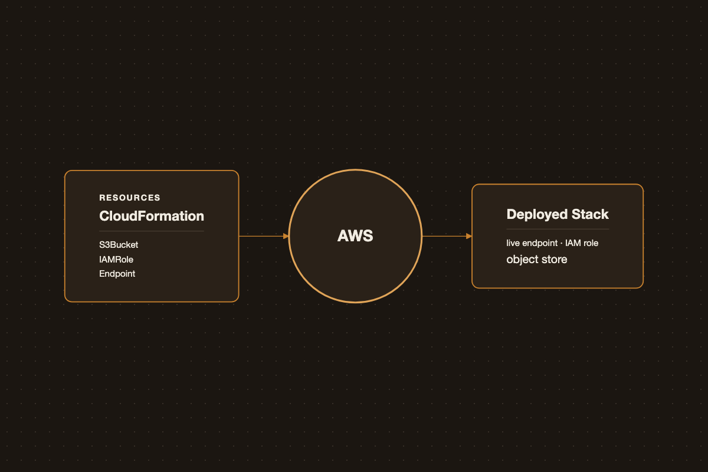

# Deploying a Machine Learning Project with AWS CloudFormation

{.post-banner fig-alt="Deploying a Machine Learning Project with AWS CloudFormation"}

Clicking through the AWS console to deploy a model works once. Infrastructure as code makes it reproducible: the same template spins up dev, staging, and prod, and can be reviewed and versioned like any other code.

## What Is Infrastructure as Code?

Infrastructure as Code (IaC) means describing infrastructure — networks, IAM roles, compute, storage — in a text file instead of provisioning it by hand. That file is checked into version control, reviewed in a pull request, and applied by a tool that reconciles the target environment to match it. Three properties fall out of that:

- **Reproducibility** — the same definition produces the same stack in dev, staging, and prod.
- **Auditability** — changes to infrastructure show up as diffs, not as an entry in someone's shell history.
- **Idempotency** — re-applying a template that already matches reality is a no-op; the tool only acts on the delta.

IaC tools split along one main axis: **declarative vs. imperative**. Declarative tools (CloudFormation, Terraform, ARM/Bicep) describe the desired end state and let the engine figure out the create/update/delete sequence. Imperative tools (Pulumi in its general-purpose-language mode, or a hand-rolled boto3/Ansible script) describe the steps to get there. Declarative is the norm for cloud infrastructure because the engine can diff current vs. desired state and tell you what will change *before* it changes it.

CloudFormation is AWS's own declarative engine: no install, no state file to manage, and it understands AWS resource types the day they ship. The trade-off is that it only speaks AWS.

## CloudFormation vs. Terraform vs. Azure ARM/Bicep

| | **CloudFormation** | **Terraform** | **Azure ARM / Bicep** |
|---|---|---|---|
| Scope | AWS only | Multi-cloud (AWS, Azure, GCP, 100+ providers) | Azure only |
| Language | YAML/JSON | HCL | JSON (ARM) or Bicep (DSL that compiles to ARM) |
| State | Managed by AWS, no local state file | State file (local or remote backend: S3, Terraform Cloud) that you must protect and lock | Managed by Azure |
| Drift detection | Built-in (`detect-stack-drift`) | Via `terraform plan`, needs current state to be accurate | Built-in |
| Change preview | Change sets | `terraform plan` | What-if operations |
| Ecosystem | Native AWS support, SAM for serverless | Largest ecosystem, most third-party modules, works across clouds | Native Azure support, best for Azure-centric shops |
| Best fit | AWS-only teams that want zero extra tooling and tight IAM integration | Teams running multi-cloud or hybrid infra, or who want one tool for everything | Azure-only teams already inside the Microsoft stack |

For an AWS-only ML deployment like the one below, CloudFormation removes a moving part: there's no state file to lose or corrupt, and permissions are governed by the same IAM you already use for everything else in the account. Terraform earns its keep once you're provisioning outside AWS too (e.g., a Snowflake warehouse or a GCP BigQuery dataset alongside your SageMaker endpoint) — at the cost of managing state yourself. Azure's tools are the equivalent choice if your ML platform lives in Azure ML instead of SageMaker.

## Core Building Blocks

A typical ML inference stack needs:

- An **S3 bucket** to store model artifacts
- An **IAM role** with least-privilege access for the compute layer
- A **compute target** — a SageMaker endpoint for managed hosting, or Lambda/ECS for lighter-weight inference

## A Minimal Stack

```yaml
Resources:
  ModelArtifactsBucket:
    Type: AWS::S3::Bucket

  SageMakerExecutionRole:
    Type: AWS::IAM::Role
    Properties:
      AssumeRolePolicyDocument:
        Statement:
          - Effect: Allow
            Principal:
              Service: sagemaker.amazonaws.com
            Action: sts:AssumeRole
      ManagedPolicyArns:
        - arn:aws:iam::aws:policy/AmazonSageMakerFullAccess

  Model:
    Type: AWS::SageMaker::Model
    Properties:
      ExecutionRoleArn: !GetAtt SageMakerExecutionRole.Arn
      PrimaryContainer:
        Image: <ecr-image-uri>
        ModelDataUrl: !Sub "s3://${ModelArtifactsBucket}/model.tar.gz"

  EndpointConfig:
    Type: AWS::SageMaker::EndpointConfig
    Properties:
      ProductionVariants:
        - ModelName: !GetAtt Model.ModelName
          VariantName: AllTraffic
          InitialInstanceCount: 1
          InstanceType: ml.m5.large

  Endpoint:
    Type: AWS::SageMaker::Endpoint
    Properties:
      EndpointConfigName: !GetAtt EndpointConfig.EndpointConfigName
```

## Deploying the Stack

```bash
aws cloudformation deploy \
  --template-file stack.yaml \
  --stack-name ml-inference-stack \
  --capabilities CAPABILITY_IAM
```

## Tips

- Parameterize the instance type and image URI so the same template works across environments.
- Use one stack per environment (dev/staging/prod) rather than branching logic inside a single template.
- Tear down with `aws cloudformation delete-stack` when you're done — an idle SageMaker endpoint bills by the hour.

CloudFormation won't replace judgment about architecture, but it turns "how did we deploy this?" from a Slack archaeology exercise into a file you can read.

## SAM vs. Plain CloudFormation

AWS SAM (Serverless Application Model) isn't a separate deployment engine — it's a CloudFormation *transform* (`Transform: AWS::Serverless-2016-10-31`). A SAM template gets expanded into a full CloudFormation template at deploy time, plus you get a CLI built around a Lambda-centric workflow: `sam build`, `sam local invoke`, `sam deploy --guided`.

| | Plain CloudFormation | SAM |
|---|---|---|
| Best fit | Any AWS resource type — SageMaker, S3, IAM, VPC, RDS, whatever the stack needs | Serverless apps: Lambda, API Gateway, Step Functions, DynamoDB |
| Template verbosity | Full resource properties every time (IAM permissions, API Gateway integrations spelled out) | Shorthand types (`AWS::Serverless::Function`, `::Api`) expand that boilerplate for you |
| Local testing | None built-in | `sam local invoke` / `sam local start-api` run your Lambda in a local Docker container before it ever touches AWS |
| Packaging | Manual `aws cloudformation package` to zip and upload code to S3 | `sam build` handles dependency installation and packaging |
| Underlying engine | CloudFormation | Also CloudFormation — SAM templates are valid CloudFormation with one added `Transform` line |

For the SageMaker stack above, plain CloudFormation is the right call: SAM's shorthand only covers serverless resource types, and `AWS::SageMaker::Model`/`EndpointConfig`/`Endpoint` have no SAM equivalent to shrink. SAM earns its keep the moment the inference layer *is* a Lambda function — e.g., a lightweight CPU model invoked behind API Gateway, or a Lambda that calls out to a SageMaker endpoint. In that case the boilerplate SAM strips away (API Gateway wiring, Lambda execution roles and permissions) is exactly the boilerplate that pattern generates, and the local dev loop (`sam local invoke`) is something plain CloudFormation has no answer for at all. Nothing stops a single template from mixing both — SAM resources alongside raw CloudFormation ones — since a SAM template is just CloudFormation with a transform applied.

### Quick SAM How-To

```bash
# 1. Install the CLI
brew install aws-sam-cli   # or the pip/binary installer

# 2. Scaffold a project (template.yaml + function code)
sam init
```

A minimal `template.yaml` for a Lambda behind API Gateway:

```yaml
Transform: AWS::Serverless-2016-10-31
Resources:
  InferenceFunction:
    Type: AWS::Serverless::Function
    Properties:
      CodeUri: src/
      Handler: app.handler
      Runtime: python3.12
      MemorySize: 512
      Timeout: 30
      Events:
        Api:
          Type: Api
          Properties:
            Path: /predict
            Method: post
```

```bash
# 3. Install dependencies and stage the deployment artifact
sam build

# 4. Test locally, in a Docker container that mimics the Lambda runtime
sam local invoke InferenceFunction --event event.json

# 5. First deploy: walks through stack name/region/confirmation prompts
#    and saves the answers to samconfig.toml
sam deploy --guided

# Every deploy after that is just:
sam deploy
```

The rule of thumb: reach for SAM when the deployable unit is a Lambda function and you want a local test loop before every deploy; stay with plain CloudFormation when the stack is built from broader AWS resource types that SAM's transform doesn't shorten anyway.
