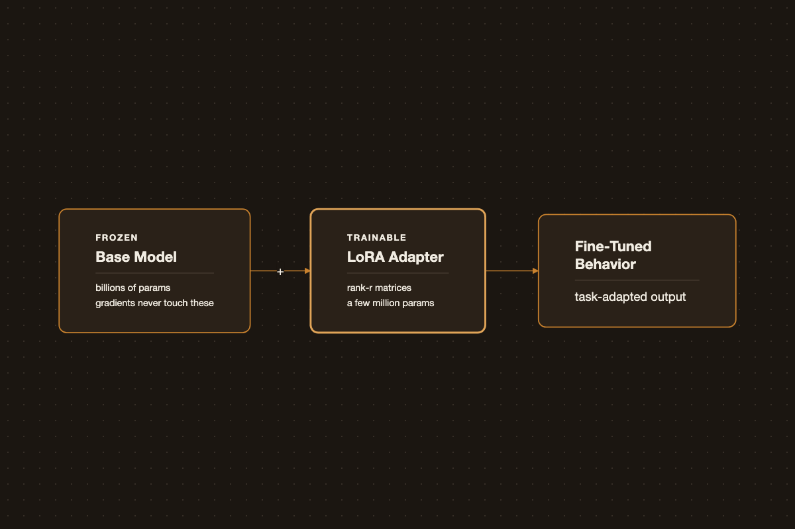

# Fine-Tuning LLMs: LoRA to AWS Bedrock

{.post-banner fig-alt="Fine-Tuning LLMs"}

Pretrained LLMs are general-purpose. Fine-tuning adapts one to a narrower domain or task using far less data and compute than pretraining from scratch.

## Full Fine-Tuning vs PEFT

Full fine-tuning updates every weight in the model - accurate, but expensive in GPU memory and easy to overfit on small datasets. Parameter-efficient fine-tuning (PEFT) methods like **LoRA** freeze the base model and train small low-rank adapter matrices instead, cutting trainable parameters by orders of magnitude while keeping most of the quality.

```python
from transformers import AutoModelForCausalLM, AutoTokenizer
from peft import LoraConfig, get_peft_model

model = AutoModelForCausalLM.from_pretrained("meta-llama/Llama-3-8b")
tokenizer = AutoTokenizer.from_pretrained("meta-llama/Llama-3-8b")

lora_config = LoraConfig(
    r=16,
    lora_alpha=32,
    target_modules=["q_proj", "v_proj"],
    lora_dropout=0.05,
    task_type="CAUSAL_LM",
)

model = get_peft_model(model, lora_config)
model.print_trainable_parameters()
```

## Data Preparation

- Keep examples in a consistent instruction/response format.
- Favor quality over quantity - a few thousand well-curated examples usually beat a large noisy dataset.
- Deduplicate aggressively; repeated examples skew the model more than expected.

## Evaluation

Track validation loss, but don't stop there - run side-by-side qualitative comparisons against the base model on real prompts. Loss going down doesn't always mean the outputs are actually better for your task.

Fine-tuning is iterative: start small with LoRA on a subset of data before committing to a full fine-tune or a larger training run.

## AWS Bedrock Custom Model Service

Bedrock's custom model service wraps three distinct customization workflows behind one managed offering - `CreateModelCustomizationJob` with a different `customizationType` - so you don't have to run your own training infrastructure. All three read training data from S3 as `.jsonl` and write a versioned custom model artifact back to your account.

### Reinforcement fine-tuning (new)

**How it works.** Instead of matching labeled outputs, the model generates several candidate responses per prompt, a *reward function* scores each one, and Bedrock updates the model with **Group Relative Policy Optimization (GRPO)** to prefer higher-scoring responses. There's no gradient step against a single "correct" answer - the signal is relative quality across the sampled candidates. This is why it suits tasks where correctness is graded rather than binary: multi-step reasoning, code generation, tool use, or open-ended writing where several answers are valid but some are clearly better.

Reward functions come in two flavors:

- **RLVR** (verifiable rewards) - a rule-based grader for objective tasks (math, code execution, format checking).
- **RLAIF** (AI feedback) - an LLM-as-judge grader for subjective tasks (instruction following, tone, RAG faithfulness), using Bedrock's built-in judge prompt templates.

As of early 2026, supported base models are Amazon Nova 2 Lite, OpenAI gpt-oss-20B, and Qwen3 32B.

**Data format.** Each record is an OpenAI-style chat-completion object with a `reference_answer` the reward function uses to grade the response - the field isn't restricted to plain text, it can be any structure your grader understands. A minimum of 100 records is required; extra fields (e.g. `difficulty_level`, `domain`) are passed through to the grader as metadata:

```json
{
  "id": "algebra_001",
  "messages": [
    {"role": "system", "content": "You are a math tutor"},
    {"role": "user", "content": "Solve: 2x + 5 = 13"}
  ],
  "reference_answer": {"solution": "x = 4", "steps": ["2x = 8", "x = 4"]},
  "difficulty_level": "easy",
  "domain": "algebra"
}
```

**Reward function (Lambda grader).** A custom grader receives the full conversation plus your `reference_answer` in `metadata`, and must return a normalized reward per sample:

```python
def lambda_handler(event, context):
    results = []
    for sample in event:
        response_text = sample["messages"][-1]["content"]
        reference = sample["metadata"]["reference_answer"]

        # your scoring logic - exact match, execution check, semantic diff, etc.
        score = score_response(response_text, reference)

        results.append({
            "id": sample["id"],
            "aggregate_reward_score": score,   # normalized, e.g. 0.0-1.0
            "metrics_list": [
                {"name": "accuracy", "value": score, "type": "Reward"}
            ],
        })
    return results
```

**Launching a job (boto3):**

```python
import boto3

client = boto3.client("bedrock")

response = client.create_model_customization_job(
    jobName="rft-math-tutor",
    customModelName="nova-lite-math-rft",
    roleArn="arn:aws:iam::<account-id>:role/BedrockCustomizationRole",
    baseModelIdentifier="amazon.nova-2-lite-v1:0:256k",
    customizationType="REINFORCEMENT_FINE_TUNING",
    trainingDataConfig={"s3Uri": "s3://my-bucket/rft/train.jsonl"},
    validationDataConfig={"validators": [{"s3Uri": "s3://my-bucket/rft/val.jsonl"}]},
    outputDataConfig={"s3Uri": "s3://my-bucket/rft/output/"},
    customizationConfig={
        "rftConfig": {
            "graderConfig": {
                "lambdaGrader": {"lambdaArn": "arn:aws:lambda:us-east-1:<account-id>:function:math-grader"}
            },
            "hyperParameters": {"epochCount": 3, "trainingSamplePerPrompt": 4},
        }
    },
)
```

**Evaluation metrics.** Training emits **average reward** and **validation reward** curves per checkpoint (validation reward is expected to trail training reward - a widening gap signals overfitting), plus **validation episode length** to track response verbosity. Beyond the training curves, Bedrock lets you A/B the RFT model against the base model with the same prompt set in the Playground, or run a full **Model Evaluation** job with your own test set for a systematic before/after comparison.

### Supervised fine-tuning

**How it works.** Standard supervised learning: the model is trained to reproduce labeled `prompt → completion` pairs, minimizing next-token loss directly against the target text. It's the right default when you already have good examples of the exact output you want and don't need a scored, multi-candidate signal.

**Data format.** For non-conversational tasks it's flat prompt/completion pairs; for chat models it follows the Converse API message schema with `system`/`user`/`assistant` turns:

```json
{"prompt": "Summarize the article about climate change.", "completion": "Climate change refers to the long-term alteration of temperature and typical weather patterns in a place."}
```

```json
{
  "system": "You are a helpful assistant.",
  "messages": [
    {"role": "user", "content": "What is AWS?"},
    {"role": "assistant", "content": "It's Amazon Web Services."}
  ]
}
```

Minimums vary by model - e.g. 32 records for Claude 3 Haiku, 100 for Llama 3.1/3.3 - up to 10,000 training records by default (adjustable via service quota).

**Launching a job (boto3):**

```python
response = client.create_model_customization_job(
    jobName="sft-support-tone",
    customModelName="haiku-support-v1",
    roleArn="arn:aws:iam::<account-id>:role/BedrockCustomizationRole",
    baseModelIdentifier="anthropic.claude-3-haiku-20240307-v1:0",
    customizationType="FINE_TUNING",
    trainingDataConfig={"s3Uri": "s3://my-bucket/sft/train.jsonl"},
    validationDataConfig={"validators": [{"s3Uri": "s3://my-bucket/sft/val.jsonl"}]},
    outputDataConfig={"s3Uri": "s3://my-bucket/sft/output/"},
    hyperParameters={"epochCount": "3", "learningRate": "0.00001", "batchSize": "8"},
)
```

**Evaluation metrics.** Bedrock reports **training and validation loss** curves after the job completes - useful for spotting under/overfitting, but not a proxy for task quality. Pair it with a Bedrock **Model Evaluation** job on held-out prompts using reference-based automatic metrics - **ROUGE** for summarization, token-level **F1** for QA/extraction, **BERTScore** for semantic similarity where wording legitimately varies - and, for open-ended output, an LLM-as-judge score alongside a manual side-by-side read against the base model.

### Distillation

**How it works.** A large **teacher** model generates (or already has, via invocation logs) responses to your prompts, and those responses fine-tune a smaller, cheaper **student** model. Bedrock can also apply proprietary data-synthesis techniques - generating paraphrased prompts, expanding coverage - to enrich a small seed set up to 15k prompt-response pairs before training the student. In practice this trades a few points of accuracy for large latency and cost wins: AWS reports distilled models running up to 500% faster and 75% cheaper, with well under 2% accuracy loss on tasks like RAG.

**Data format.** The input is just prompts - no labels needed unless you want to anchor quality:

```json
{"prompt": "Classify the sentiment of this review: 'The battery life is incredible.'"}
```

Alternatively, reuse **invocation logs** already stored in S3 (with CloudWatch invocation logging enabled) as training data, optionally filtered by `requestMetadata`:

```json
{"requestMetadata": {"project": "CustomerService", "priority": "High"}}
```

If the teacher model matches the model that produced the logs, Bedrock reuses the logged responses directly instead of re-querying the teacher - cheaper, since no new teacher inference is billed.

**Launching a job (boto3):**

```python
response = client.create_model_customization_job(
    jobName="distill-support-classifier",
    customModelName="titan-lite-support-distilled",
    roleArn="arn:aws:iam::<account-id>:role/BedrockCustomizationRole",
    baseModelIdentifier="amazon.titan-text-lite-v1",  # student model
    customizationType="DISTILLATION",
    trainingDataConfig={"s3Uri": "s3://my-bucket/distill/prompts.jsonl"},
    outputDataConfig={"s3Uri": "s3://my-bucket/distill/output/"},
    customizationConfig={
        "distillationConfig": {
            "teacherModelConfig": {"teacherModelIdentifier": "anthropic.claude-3-5-sonnet-20240620-v1:0"}
        }
    },
)
```

**Evaluation metrics.** Because the whole point is a favorable accuracy/latency/cost trade, evaluate the student against the teacher on all three axes rather than accuracy alone: run a Bedrock **Model Evaluation** job with the same test prompts through both models to get a direct accuracy delta, then separately track p50/p90 **latency** and **cost per 1K tokens** for the student versus teacher to confirm the trade you're accepting is the one you intended.

Across all three, the pattern is the same: RFT trades labeled data for a scored signal on hard, multi-step tasks; SFT is the direct route when you already have good labeled examples; distillation isn't really about teaching new behavior - it's compressing a model you already trust into something faster and cheaper to run.
