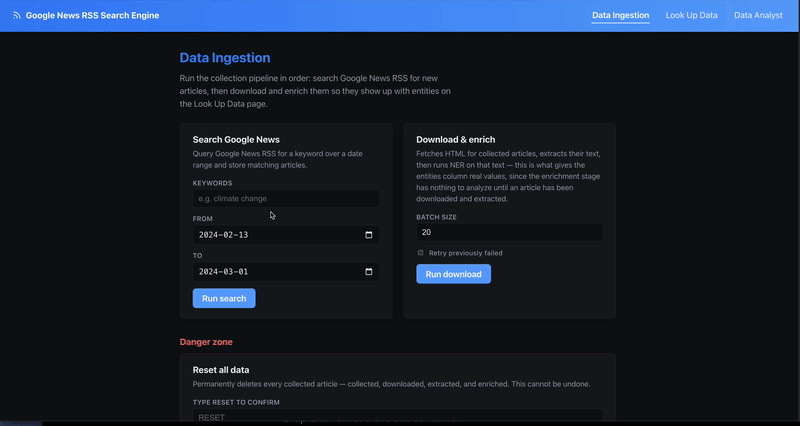
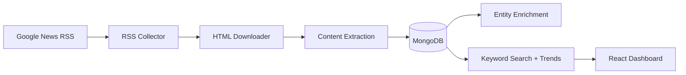

# Google News RSS Radar: Collecting News Into MongoDB for Search and Trend Analysis

{.post-banner fig-alt="Google News RSS Radar demo - collecting, searching, and browsing trends across news articles"}

Google News RSS Radar is a four-stage Node.js pipeline - collect, download, extract, enrich - that turns a keyword and a date range into a searchable, trend-analyzable archive of full article text. It's fundamentally a data engineering project: pull raw entries from an RSS feed, progressively enrich each one into a single flexible document, land everything in MongoDB, and build search and trend analysis on top of that one collection. Each stage's choices keep it dependency-light: no headless browser unless the plain HTTP fetch actually needs one, and no external search/analytics service beyond MongoDB itself.



## Stage 1: Collect - Google News RSS Has No Pagination, So Fake It With Date Chunks

Google News RSS supports `after:`/`before:` query operators, but each feed only returns a capped number of items regardless of the date range requested. `splitDateRange` works around this by chunking a wide date range into fixed windows (7 days by default) and firing one RSS request per chunk:

```js
export function splitDateRange(dateFrom, dateTo, timeDeltaDays = DEFAULT_TIME_DELTA_DAYS) {
  const start = parseISO(dateFrom);
  const end = parseISO(dateTo);
  if (differenceInCalendarDays(end, start) <= 0) {
    return [{ from: dateFrom, to: dateTo }];
  }
  const chunks = [];
  let chunkStart = start;
  while (isBefore(chunkStart, end)) {
    const tentativeEnd = addDays(chunkStart, timeDeltaDays);
    const chunkEnd = isBefore(end, tentativeEnd) ? end : tentativeEnd;
    chunks.push({ from: format(chunkStart, "yyyy-MM-dd"), to: format(chunkEnd, "yyyy-MM-dd") });
    chunkStart = chunkEnd;
  }
  return chunks;
}
```

Each chunk becomes its own query URL against `news.google.com/rss/search`, and `collectBatch` fans this out further - a plain text file of `keyword;dateFrom;dateTo` lines lets a full backfill run as one CLI command instead of one invocation per keyword. Every entry is upserted into MongoDB immediately, so the collection is the pipeline's single source of truth from the very first stage.

## Stage 2: Download - Try Plain HTTP First, Fall Back to a Browser

Downloading is the stage most scrapers over-engineer by reaching for a headless browser on every request. This pipeline only pays that cost when it has to:

```js
async function downloadOne(article) {
  const httpResult = await fetchHttp(url);
  if (isContentSufficient(httpResult.html)) {
    await markDownloaded(uuid, { html: httpResult.html, method: "http", ... });
    return { uuid, method: "http" };
  }
  const browserResult = await fetchBrowser(url);
  await markDownloaded(uuid, { html: browserResult.html, method: "browser", ... });
  return { uuid, method: "browser" };
}
```

`isContentSufficient` is a cheap heuristic - parse with Cheerio, check the body text is at least 500 characters and there's an `<article>` tag or at least 3 `<p>` tags. Most publisher sites serve usable HTML on a plain `fetch`; the ones that don't (client-side-rendered pages, JS-gated paywalls) fall through to a Playwright-driven Chromium instance that waits for `networkidle` before grabbing `page.content()`. The browser is lazily launched once and reused across the whole batch via a memoized promise, and explicitly closed at the end of the run - a headless Chromium process left running is an easy leak to introduce in a script that's supposed to exit.

Concurrency is capped with `p-limit` (4 by default) rather than firing every pending article's fetch at once, which matters more for the browser fallback path than the HTTP one - a handful of concurrent Chromium contexts is a very different memory footprint than a handful of `fetch` calls.

## Stage 3: Extract - JSON-LD First, Readability Second, Meta Tags as a Last Resort

Article extraction layers three signal sources with a clear precedence, because no single one is reliable across every publisher:

```js
const jsonLd = extractJsonLd(document);        // schema.org NewsArticle block
const reader = new Readability(document.cloneNode(true));
const parsed = reader.parse();                  // Mozilla's readability algorithm

const title = jsonLd?.headline || parsed?.title || metaContent(document, [...]) || null;
const publishedRaw = jsonLd?.datePublished || metaContent(document, [...]) || document.querySelector("time")?.getAttribute("datetime");
```

JSON-LD (`<script type="application/ld+json">` with an `Article`/`NewsArticle` `@type`) is structured data publishers embed specifically for search engines and social previews - when it's present, it's more precise than anything Readability infers from DOM shape. Readability (the same library behind Firefox's Reader Mode) handles the body text extraction, stripping nav bars, ads, and related-article rails. Meta tags (`og:title`, `article:published_time`) are the fallback when neither of the above is present. The extraction method used (`readability+jsonld`, `readability`, or `meta-fallback`) gets stored alongside the result, which turns "why is this article's title wrong" from a debugging session into a one-field lookup.

## Storing Everything as One Flexible Document

Every stage writes back onto the same `articles` document by `uuid` - RSS metadata, downloaded HTML, extracted text, enrichment output - rather than splitting the pipeline across separate tables. A `status` field (`collected` → `downloaded` → `extracted` → `enriched`, with `*_failed` variants) tracks how far along each article is, so re-running a stage is just a query for documents stuck at the previous status:

```js
export const STATUS = {
  COLLECTED: "collected",
  DOWNLOAD_FAILED: "download_failed",
  DOWNLOADED: "downloaded",
  EXTRACTION_FAILED: "extraction_failed",
  EXTRACTED: "extracted",
  ENRICH_FAILED: "enrich_failed",
  ENRICHED: "enriched",
};
```

This is where MongoDB's schema flexibility earns its keep: an RSS entry, a downloaded HTML blob, and a structured extraction result don't look anything alike, but they can all live as nested fields on the same document without a migration every time a stage's output shape changes.

## Stage 4: Enrich - Local Entity Extraction Over the Stored Text

The enrichment stage runs a small local NLP model over each article's extracted text to pull out structured tags for analysis - people, organizations, places - rather than leaving the article as an opaque text blob:

```python
LABEL_MAP = {
    "PERSON": "person", "ORG": "organization", "GPE": "place",
    "LOC": "place", "FAC": "place", "NORP": "group",
    "EVENT": "event", "PRODUCT": "product", "WORK_OF_ART": "work",
    "LAW": "law", "LANGUAGE": "language",
}

@app.post("/ner", response_model=list[Entity])
def ner(req: NerRequest):
    doc = nlp(req.text or "")
    # named entities from spaCy's NER, collapsed by (text, type) with counts
    # + generic noun-chunk "keywords" for anything not already a named entity
    ...
```

A tiny FastAPI service (`packages/ner-service`, `en_core_web_sm`) does this tagging over plain HTTP, called from the Node pipeline. The output - a list of `{text, type, count}` entries per article - becomes another indexable field on the document, which is what turns "search for articles mentioning a company" from a text-match guess into a structured filter.

## Search and Trends Without a Search Engine

With four pipeline stages landing structured data in MongoDB, search and trend analysis are both just queries against one `articles` collection - no Elasticsearch, no separate analytics store:

```js
await articles.createIndex(
  {
    "rss.title": "text", "rss.summary": "text",
    "extraction.title": "text", "extraction.text": "text",
  },
  { name: "articles_text_idx" }
);
```

`GET /api/articles?q=` runs against Mongo's built-in `$text` index; `GET /api/trends?dimension=day|source` aggregates article counts by day or by source over a date range, which is the basic building block for "is coverage of this topic rising or falling" without a dedicated analytics pipeline.

## Running It

```bash
docker compose up -d mongo   # MongoDB
npm run ner:up                # entity extraction service on :8001
npm install && npx playwright install chromium
cp .env.example .env
npm run db:indexes

npm run pipeline -- "Generative AI" 2026-01-01 2026-01-09   # collect -> download -> extract -> enrich
npm run dev                                                    # API on :4000, dashboard on :5173
```

`npm run collect-batch -- examples/collect-batch-input.example.txt` runs the same pipeline across a whole file of `keyword;dateFrom;dateTo` lines for backfilling multiple topics at once.

## Lessons Learned

- **A cheap heuristic beats a blanket policy.** Checking body-text length and paragraph count before reaching for Playwright keeps the common case fast and only pays the browser-automation cost where it's actually needed.
- **One flexible document per article beats a rigid multi-table schema.** RSS metadata, raw HTML, extracted text, and enrichment tags all live on the same evolving document, keyed by status - adding a new stage's output is a new nested field, not a migration.
- **Storing the extraction method alongside the result pays off during debugging.** Knowing whether a title came from JSON-LD, Readability, or a meta-tag fallback turns "this field looks wrong" into an immediate diagnosis instead of a re-scrape.

Next: extend the trends API with more dimensions (entity co-occurrence, source-over-time breakdowns) now that enrichment tags are already stored per article, and look at pre-aggregating the heavier trend queries instead of computing them on read.
