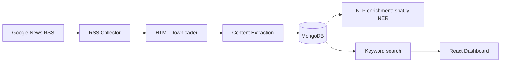

# Google News RSS Radar: A Full News Pipeline Without an LLM in Sight

{.post-banner fig-alt="Google News RSS Radar demo — collecting, searching, and browsing trends across news articles"}

Google News RSS Radar is a four-stage Node.js pipeline — collect, download, extract, enrich — that turns a keyword and a date range into a searchable, trend-analyzable archive of full article text. What makes it worth writing up isn't the pipeline shape (that's standard ETL), it's the choices at each stage that keep it dependency-light: no LLM API for enrichment, no headless browser unless the plain HTTP fetch actually needs one, and no external search service beyond MongoDB itself.



## Stage 1: Collect — Google News RSS Has No Pagination, So Fake It With Date Chunks

Google News RSS supports `after:`/`before:` query operators, but each feed only returns a capped number of items regardless of the date range requested. `splitDateRange` works around this by chunking a wide date range into fixed windows (7 days by default) and firing one RSS request per chunk:

```js
export function splitDateRange(dateFrom, dateTo, timeDeltaDays = DEFAULT_TIME_DELTA_DAYS) {
  const start = parseISO(dateFrom);
  const end = parseISO(dateTo);
  if (differenceInCalendarDays(end, start) <= 0) {
    return [{ from: dateFrom, to: dateTo }];
  }
  const chunks = [];
  let chunkStart = start;
  while (isBefore(chunkStart, end)) {
    const tentativeEnd = addDays(chunkStart, timeDeltaDays);
    const chunkEnd = isBefore(end, tentativeEnd) ? end : tentativeEnd;
    chunks.push({ from: format(chunkStart, "yyyy-MM-dd"), to: format(chunkEnd, "yyyy-MM-dd") });
    chunkStart = chunkEnd;
  }
  return chunks;
}
```

Each chunk becomes its own query URL against `news.google.com/rss/search`, and `collectBatch` fans this out further — a plain text file of `keyword;dateFrom;dateTo` lines lets a full backfill run as one CLI command instead of one invocation per keyword.

## Stage 2: Download — Try Plain HTTP First, Fall Back to a Browser

Downloading is the stage most scrapers over-engineer by reaching for a headless browser on every request. This pipeline only pays that cost when it has to:

```js
async function downloadOne(article) {
  const httpResult = await fetchHttp(url);
  if (isContentSufficient(httpResult.html)) {
    await markDownloaded(uuid, { html: httpResult.html, method: "http", ... });
    return { uuid, method: "http" };
  }
  const browserResult = await fetchBrowser(url);
  await markDownloaded(uuid, { html: browserResult.html, method: "browser", ... });
  return { uuid, method: "browser" };
}
```

`isContentSufficient` is a cheap heuristic — parse with Cheerio, check the body text is at least 500 characters and there's an `<article>` tag or at least 3 `<p>` tags. Most publisher sites serve usable HTML on a plain `fetch`; the ones that don't (client-side-rendered pages, JS-gated paywalls) fall through to a Playwright-driven Chromium instance that waits for `networkidle` before grabbing `page.content()`. The browser is lazily launched once and reused across the whole batch via a memoized promise, and explicitly closed at the end of the run — a headless Chromium process left running is an easy leak to introduce in a script that's supposed to exit.

Concurrency is capped with `p-limit` (4 by default) rather than firing every pending article's fetch at once, which matters more for the browser fallback path than the HTTP one — a handful of concurrent Chromium contexts is a very different memory footprint than a handful of `fetch` calls.

## Stage 3: Extract — JSON-LD First, Readability Second, Meta Tags as a Last Resort

Article extraction layers three signal sources with a clear precedence, because no single one is reliable across every publisher:

```js
const jsonLd = extractJsonLd(document);        // schema.org NewsArticle block
const reader = new Readability(document.cloneNode(true));
const parsed = reader.parse();                  // Mozilla's readability algorithm

const title = jsonLd?.headline || parsed?.title || metaContent(document, [...]) || null;
const publishedRaw = jsonLd?.datePublished || metaContent(document, [...]) || document.querySelector("time")?.getAttribute("datetime");
```

JSON-LD (`<script type="application/ld+json">` with an `Article`/`NewsArticle` `@type`) is structured data publishers embed specifically for search engines and social previews — when it's present, it's more precise than anything Readability infers from DOM shape. Readability (the same library behind Firefox's Reader Mode) handles the body text extraction, stripping nav bars, ads, and related-article rails. Meta tags (`og:title`, `article:published_time`) are the fallback when neither of the above is present. The extraction method used (`readability+jsonld`, `readability`, or `meta-fallback`) gets stored alongside the result, which turns "why is this article's title wrong" from a debugging session into a one-field lookup.

## Stage 4: Enrich — Local NER Instead of an LLM Call

The enrichment stage is deliberately built around a local spaCy model rather than an LLM API:

```python
LABEL_MAP = {
    "PERSON": "person", "ORG": "organization", "GPE": "place",
    "LOC": "place", "FAC": "place", "NORP": "group",
    "EVENT": "event", "PRODUCT": "product", "WORK_OF_ART": "work",
    "LAW": "law", "LANGUAGE": "language",
}

@app.post("/ner", response_model=list[Entity])
def ner(req: NerRequest):
    doc = nlp(req.text or "")
    # named entities from spaCy's NER, collapsed by (text, type) with counts
    # + generic noun-chunk "keywords" for anything not already a named entity
    ...
```

A tiny FastAPI service (`packages/ner-service`, `en_core_web_sm`) does entity recognition and noun-chunk keyword extraction over each article's text, called over plain HTTP from the Node pipeline. This buys deterministic, free, offline enrichment for the parts of the job that are genuinely a tagging problem — people, organizations, places — without spending an LLM call per article. `enrich.js` is explicit about where that trade-off ends: `analyzeSentiment` and `classifyTopics` are stub functions with a `TODO` pointing at "wire in a real LLM call here," because sentiment and topic classification need judgment a rule-based tagger doesn't have, while entity extraction doesn't.

## Search and Trends Without a Search Engine

With four pipeline stages landing structured data in MongoDB, search and trends are both just queries against one `articles` collection — no Elasticsearch, no separate analytics store:

```js
await articles.createIndex(
  {
    "rss.title": "text", "rss.summary": "text",
    "extraction.title": "text", "extraction.text": "text",
  },
  { name: "articles_text_idx" }
);
```

`GET /api/articles?q=` runs against Mongo's built-in `$text` index; `GET /api/trends?dimension=day|source` aggregates counts by day or by source over a date range. `searchService.js` already documents the extension point for going semantic later — add an `embedding` field at extraction time, stand up a Mongo Atlas vector index, and branch on a `mode=semantic` param — without touching the keyword path already in production.

## Running It

```bash
docker compose up -d mongo   # MongoDB
npm run ner:up                # spaCy NER service on :8001
npm install && npx playwright install chromium
cp .env.example .env
npm run db:indexes

npm run pipeline -- "Generative AI" 2026-01-01 2026-01-09   # collect -> download -> extract -> enrich
npm run dev                                                    # API on :4000, dashboard on :5173
```

`npm run collect-batch -- examples/collect-batch-input.example.txt` runs the same pipeline across a whole file of `keyword;dateFrom;dateTo` lines for backfilling multiple topics at once.

## Lessons Learned

- **A cheap heuristic beats a blanket policy.** Checking body-text length and paragraph count before reaching for Playwright keeps the common case fast and only pays the browser-automation cost where it's actually needed.
- **Local NER is a legitimate default, not just a fallback.** For a fixed taxonomy (people, orgs, places), a local spaCy model is deterministic, free, and has no rate limit — reserving LLM calls for the tasks (sentiment, topic classification) that actually need open-ended judgment is a better allocation of that cost, not a compromise.
- **Storing the extraction method alongside the result pays off during debugging.** Knowing whether a title came from JSON-LD, Readability, or a meta-tag fallback turns "this field looks wrong" into an immediate diagnosis instead of a re-scrape.

Next: wire a real LLM call into `classifyTopics` and `analyzeSentiment` now that the stub interfaces are already in place, and add the `embedding` field + Atlas vector index that `searchService.js` already anticipates for semantic search.
