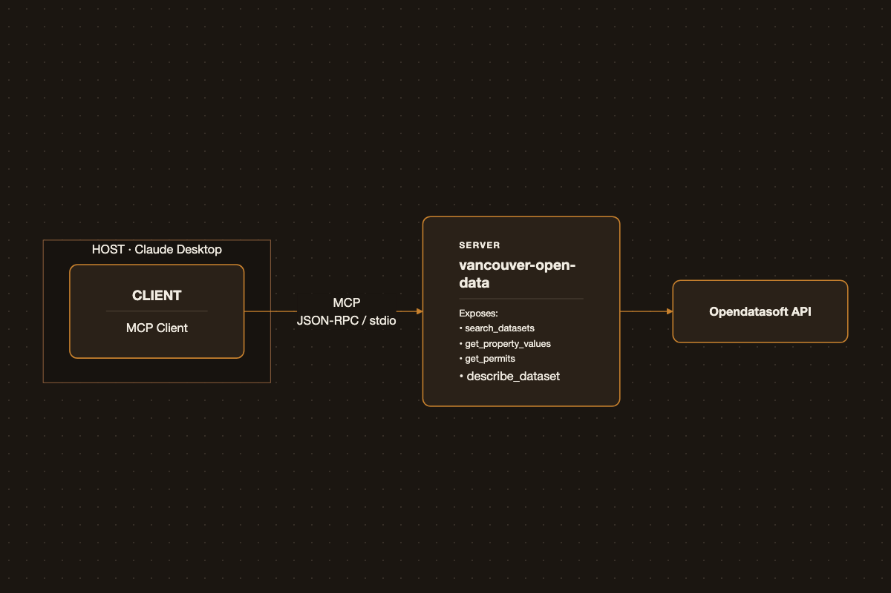

# Building an MCP Server for Vancouver's Open Data

{.post-banner fig-alt="Building an MCP Server for Vancouver's Open Data"}

The City of Vancouver publishes hundreds of public datasets — property assessments, building permits, public art, parking meters — through a REST API. Wiring that API up as an MCP server means any MCP-compatible LLM client can query it directly, with natural language instead of hand-written filter syntax.

## Why MCP Fits Open Data

The Model Context Protocol standardizes how an LLM discovers and calls external tools. Open data portals are a good match for a few reasons:

- **The data is already structured** — each dataset has a stable schema, so tool inputs/outputs map cleanly to typed function signatures.
- **Discovery is the hard part.** Most people don't know a dataset called `issued-building-permits` exists, let alone its field names. An MCP server can expose search as a tool, so the model finds the right dataset instead of the user having to.
- **No auth complexity.** Vancouver's portal is fully public and read-only, so the server doesn't need to manage credentials or write access — it's a thin, safe translation layer.

## MCP Building Blocks: Hosts, Clients, Servers, Transports

Before wiring up Vancouver's data, it's worth being precise about what "an MCP server" actually plugs into. The spec defines a handful of distinct pieces:

- **Host** — the user-facing application (Claude Desktop, an IDE, a custom agent). It owns the LLM conversation and decides which servers to connect to.
- **Client** — lives inside the host, maintains a 1:1 connection to a single server, and handles the JSON-RPC message plumbing. A host with three servers configured runs three clients internally.
- **Server** — the process you actually write. It advertises capabilities and responds to client requests. This post's `vancouver-open-data` server is one of these.
- **Tools** — model-invoked functions with a name, description, and JSON-schema input (`search_datasets`, `get_property_values` above). The LLM decides when to call them based on the conversation.
- **Resources** — addressable, read-only data the *host application* can pull in (a dataset schema, a file, a config blob) without it necessarily going through the model's tool-calling loop. Cheaper than a tool call when the client just needs to display or attach data.
- **Prompts** — reusable, user-triggered templates (e.g., a "/summarize-permits" slash command) that expand into a preset message, as opposed to tools which the model chooses on its own.

For the Vancouver server, only **tools** are used today — the "Next Steps" section below is really about starting to use **resources** for the schema-lookup use case, since `describe_dataset` is a better fit as something the client fetches directly than as a model-invoked round trip.

### Transports

Transport is the channel the client and server exchange JSON-RPC messages over. MCP currently defines two:

| Transport | How it works | When to use it |
|---|---|---|
| **stdio** | Host spawns the server as a local subprocess; messages go over stdin/stdout | Local tools, CLI integrations, anything running on the same machine as the host — no network, no auth needed |
| **Streamable HTTP** | Server runs as a standalone HTTP endpoint; client POSTs JSON-RPC and can receive streamed responses via SSE | Remote/shared servers, multi-client access, anything needing auth headers or running behind a real deployment |

(An older HTTP+SSE transport with two separate endpoints predates Streamable HTTP and is now considered legacy.)

The Vancouver server uses **stdio** — `mcp.run(transport="stdio")` in the code below — because it's a single-user, local integration registered directly in Claude Desktop's config. There's no case for standing up an HTTP server just to query a public, read-only API from one machine.

## Vancouver's Open Data API

Vancouver's portal (`opendata.vancouver.ca`) runs on Opendatasoft, exposed through a REST API at:

```
https://opendata.vancouver.ca/api/explore/v2.1/catalog/datasets/{dataset_id}/records
```

Each dataset accepts `where` (an SQL-like filter expression), `limit`, `offset`, and `order_by` query params, and returns JSON records with a consistent `results` envelope. A handful of datasets cover most useful queries:

| Dataset ID | Contents |
|---|---|
| `property-tax-report` | Assessed values by address, year, tax levies |
| `issued-building-permits` | Permit type, address, project value, issue date |
| `public-art` | Artwork title, artist, location, install year |

## Designing the MCP Tools

Rather than exposing the raw API 1:1, I mapped it to a small set of task-shaped tools plus a discovery tool:

- `search_datasets(query)` — keyword search over the catalog, returns dataset IDs and descriptions.
- `get_property_values(address, year)` — assessed value lookup for a street address.
- `get_permits(address, permit_type, since)` — building permits filtered by location, type, date.
- `describe_dataset(dataset_id)` — returns field names and types, so the model can build valid `where` filters for datasets it hasn't seen before.

Keeping tools narrow (rather than one generic `query(dataset, filter)` tool) makes the model's job easier — it doesn't need to guess field names, and each tool can validate and sanitize its own inputs.

## Implementation

The server is built with the Python MCP SDK's `FastMCP`, talking to the Opendatasoft API over `httpx`:

```python
from mcp.server.fastmcp import FastMCP
import httpx

mcp = FastMCP("vancouver-open-data")
BASE_URL = "https://opendata.vancouver.ca/api/explore/v2.1/catalog/datasets"


@mcp.tool()
async def search_datasets(query: str, limit: int = 10) -> list[dict]:
    """Search the City of Vancouver's open data catalog by keyword."""
    async with httpx.AsyncClient() as client:
        resp = await client.get(
            BASE_URL, params={"where": f'search("{query}")', "limit": limit}
        )
        resp.raise_for_status()
        return [
            {"id": d["dataset_id"], "title": d["metas"]["default"]["title"]}
            for d in resp.json()["results"]
        ]


@mcp.tool()
async def get_property_values(address: str, year: int | None = None, limit: int = 5) -> list[dict]:
    """Look up assessed property values for a given street address."""
    where = f'street_name like "{address}"'
    if year:
        where += f" and tax_assessment_year = {year}"
    async with httpx.AsyncClient() as client:
        resp = await client.get(
            f"{BASE_URL}/property-tax-report/records",
            params={"where": where, "limit": limit},
        )
        resp.raise_for_status()
        return resp.json()["results"]


if __name__ == "__main__":
    mcp.run(transport="stdio")
```

Registering it with Claude Desktop (or any MCP client) is a one-line config entry pointing at the server's entrypoint over stdio — no separate hosting needed for local use.

## Python vs TypeScript: Same Server, Two SDKs

MCP has first-party SDKs in both languages, and the same `search_datasets` tool looks like this in TypeScript with `@modelcontextprotocol/sdk`:

```typescript
import { McpServer } from "@modelcontextprotocol/sdk/server/mcp.js";
import { StdioServerTransport } from "@modelcontextprotocol/sdk/server/stdio.js";
import { z } from "zod";

const server = new McpServer({ name: "vancouver-open-data", version: "1.0.0" });
const BASE_URL = "https://opendata.vancouver.ca/api/explore/v2.1/catalog/datasets";

server.tool(
  "search_datasets",
  "Search the City of Vancouver's open data catalog by keyword.",
  { query: z.string(), limit: z.number().default(10) },
  async ({ query, limit }) => {
    const url = new URL(BASE_URL);
    url.searchParams.set("where", `search("${query}")`);
    url.searchParams.set("limit", String(limit));
    const res = await fetch(url);
    const { results } = await res.json();
    const datasets = results.map((d: any) => ({
      id: d.dataset_id,
      title: d.metas.default.title,
    }));
    return { content: [{ type: "text", text: JSON.stringify(datasets) }] };
  }
);

await server.connect(new StdioServerTransport());
```

A few things stand out doing it both ways:

| | Python (`FastMCP`) | TypeScript (`McpServer`) |
|---|---|---|
| Tool registration | `@mcp.tool()` decorator on a plain function | `server.tool(name, description, schema, handler)` call |
| Input validation | Python type hints, inferred into JSON schema | Explicit `zod` schema — more verbose, but the shape is visible at the call site |
| Return value | Return the value directly (list/dict); SDK wraps it | Must hand-wrap into `{ content: [{ type: "text", ... }] }` yourself |
| Docstring vs description | Docstring *is* the tool description shown to the model | Description is a separate string argument |
| Async | `async def`, `httpx.AsyncClient` | `async`/`await`, native `fetch` |
| Ecosystem fit | Natural if the data/ML stack (pandas, existing scripts) is already Python | Natural if the server needs to live next to a Node/web backend, or ship as an npm package |

Functionally they're equivalent — both compile down to the same JSON-RPC-over-stdio wire format, so a Claude Desktop config can't tell the difference. The real deciding factor is which language the surrounding project already lives in: FastMCP's decorator + type-hint style is less code for a Python-only script like this one, while the TypeScript SDK's explicit Zod schemas pay off more in a larger codebase where you want the tool's input contract checked at compile time.

## Example Queries and Results

Once connected, a prompt like:

> "What's the assessed value trend for 123 Main St over the last few years, and were any permits pulled recently?"

resolves into two tool calls — `get_property_values(address="123 Main St")` and `get_permits(address="123 Main St", since="2023-01-01")` — and the model composes the JSON results into a plain-language answer, without the user ever touching the Opendatasoft query syntax.

## Lessons Learned and Next Steps

- **Schema drift is real.** Field names differ across datasets (`street_name` vs `civic_address`), which is why `describe_dataset` ended up necessary rather than optional — the model needs a way to check before it guesses.
- **Narrow tools beat clever ones.** An earlier version exposed a single generic `query` tool; the model produced malformed `where` clauses often enough that splitting into task-specific tools was a clear win for reliability.
- **Rate limits matter at demo time.** The public API is generous but not unlimited — a thin caching layer in front of `get_property_values` and `get_permits` avoided repeat calls during iterative testing.

Next: expose dataset schemas as MCP *resources* (not just a tool) so clients can inspect them without a round trip, add a small on-disk cache, and cover a couple more datasets (transit stops, parking meters) once the pattern holds up.
