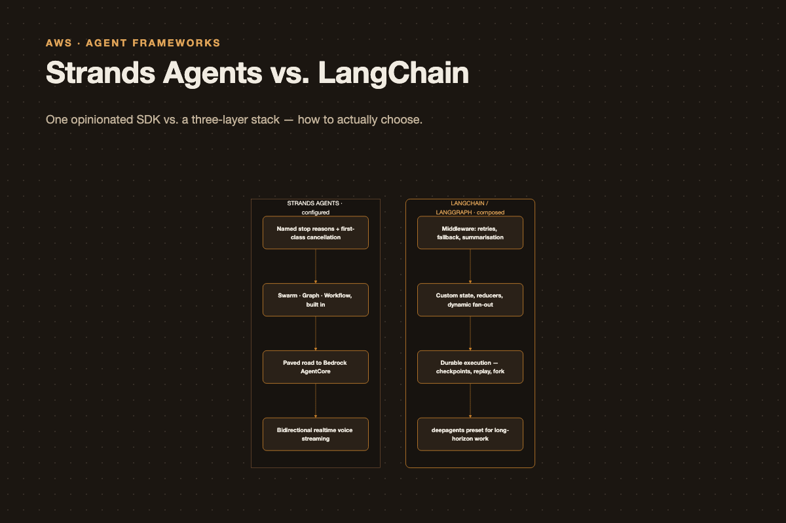

# Strands vs. LangChain: Choose the Execution Model, Not the Agent Loop

{.post-banner fig-alt="Strands vs. LangChain"}

Every few months, a team asks some version of the same question: *we are building an agent—should we use Strands or LangChain?*

The question is reasonable, but the comparison is slightly off. Neither framework's interesting innovation is the basic model → tool → observation loop. Both can do that. The useful question is where each system puts the structure around that loop:

- How do you model state and control flow?
- What happens when an execution stops, fails, or needs a human?
- Can you resume, inspect, replay, or fork a run?
- How much multi-agent orchestration do you want supplied versus composed?

With that framing, the choice becomes much clearer.

## What are we comparing?

"LangChain" is now best understood as a stack with distinct layers:

- **LangGraph** is the runtime: a stateful graph engine with nodes, edges, reducers, checkpoints, interrupts, and streaming.
- **LangChain `create_agent`** is an agent harness built on LangGraph: model, tools, prompt, and middleware compiled into a graph.
- **Deep Agents** is a higher-level preset for longer-running agents, adding planning, filesystem tools, subagents, memory conventions, and context management.

**Strands Agents** is more deliberately unified. It is an AWS-led SDK for Python and TypeScript centered on `Agent`, with first-class Graph and Swarm orchestration, workflow tooling, A2A support, sessions, plugins, and observability.

That means this is not a simple framework-versus-framework decision:

> LangGraph gives you a runtime to compose unusual execution models. Strands gives you an opinionated SDK with useful agent and multi-agent shapes ready to configure.

Everything else follows from that distinction.

## 1. The agent loop: change its behaviour or explain its ending?

Both ecosystems run the familiar cycle: call a model, execute requested tools, feed tool results back, and repeat until the model stops requesting tools. The differentiation is in the controls around that loop.

### LangChain: middleware is the extension point

LangChain's strongest answer is middleware. It lets you change behaviour before and after model calls, wrap tool calls, add fallbacks, retry failures, manage context, enforce limits, or pause for approval without reimplementing the agent loop.

```python
from langchain.agents import create_agent
from langchain.agents.middleware import (
    ModelCallLimitMiddleware,
    ToolRetryMiddleware,
    ModelFallbackMiddleware,
    SummarizationMiddleware,
)

agent = create_agent(
    model="anthropic:claude-sonnet-4-6",
    tools=[search, fetch_page],
    system_prompt="You research topics thoroughly.",
    middleware=[
        ToolRetryMiddleware(max_retries=3, backoff_factor=2.0, jitter=True),
        ModelFallbackMiddleware("openai:gpt-5.5", "google:gemini-3.6-flash"),
        SummarizationMiddleware(trigger=("fraction", 0.7), keep=("messages", 20)),
        ModelCallLimitMiddleware(thread_limit=40, run_limit=25, exit_behavior="end"),
    ],
)
```

This is genuine leverage in production. Retries, fallback models, summarization, human approval, PII handling, and limits are recurring requirements. Middleware turns much of that work into configuration rather than bespoke control code.

LangGraph also has a final safety backstop: `recursion_limit`, which caps super-steps and raises a `GraphRecursionError` if a graph does not terminate. It is a graph-level limit, not a polished budget model, but it protects against runaway cycles.

### Strands: termination is explicit

Strands is especially good at making an invocation's ending legible. You can impose turn and token budgets, then inspect the returned stop reason.

```python
from strands import Agent

agent = Agent(
    name="researcher",
    system_prompt="You research topics thoroughly.",
    tools=[search, fetch_page],
)

result = agent(
    "Summarise the state of agent frameworks",
    limits={"turns": 25, "total_tokens": 200_000, "output_tokens": 8_000},
)

if result.stop_reason == "limit_turns":
    # The budget was exhausted; decide whether to resume or report partial work.
    pass
```

This seems small until an agent ends unexpectedly in production. A named reason—such as a turn budget, token budget, cancellation, content filtering, provider token cap, or natural end of turn—gives operators a concrete place to start.

Strands also treats cancellation and concurrent invocation as first-class concerns. A Python agent can be cancelled safely from another thread; cancellation is observed at defined points in the loop. One agent instance rejects overlapping calls by default, because an invocation mutates its conversation history. Those are sensible defaults for a stateful SDK.

**Choose by what hurts more:** LangChain is stronger when you need to change what happens *during* the loop. Strands is particularly pleasant when you need to understand why a run *ended*.

## Axis 2: orchestration — composed vs. configured

This is the axis that should drive your decision: do you need a runtime that lets you build an unusual multi-agent topology, or one that already ships the standard shapes?

### LangChain: a runtime you compose

The current LangChain docs no longer ship supervisor or swarm prebuilts. Multi-agent is documented as five *patterns* — subagents, handoffs, skills, router, custom workflow — and you build the one you need on `StateGraph`:

```python
from typing import Annotated, TypedDict
from operator import add
from langgraph.graph import StateGraph, START, END
from langgraph.checkpoint.memory import InMemorySaver

class State(TypedDict):
    messages: Annotated[list, add]
    findings: Annotated[list[str], add]
    attempts: int

def route(state: State) -> str:
    if state["attempts"] >= 3:
        return "report"
    return "analysis" if not state["findings"] else "report"

builder = StateGraph(State)
builder.add_node("research", research_node)
builder.add_node("analysis", analysis_node)
builder.add_node("report", report_node)

builder.add_edge(START, "research")
builder.add_edge("research", "analysis")
builder.add_conditional_edges("analysis", route, {"analysis": "analysis", "report": "report"})
builder.add_edge("report", END)

graph = builder.compile(checkpointer=InMemorySaver())
```

The state model is the real feature here. Every key can have its own reducer — `Annotated[list, add]` appends, the default overwrites, and you can write custom merge functions. That's how you get correct behaviour when parallel branches write to the same field, and Strands has no direct equivalent.

Dynamic fan-out is also cleaner:

```python
from langgraph.types import Send

def fan_out(state: State):
    return [Send("analyse_doc", {"doc": d}) for d in state["documents"]]
```

`Send` spawns one node execution per item at runtime — genuine map-reduce, where Strands' parallelism comes from static graph branches. And `Command` lets a node update state and route in one return:

```python
from langgraph.types import Command
from typing import Literal

def triage(state: State) -> Command[Literal["billing", "technical"]]:
    kind = classify(state["messages"][-1])
    return Command(update={"category": kind}, goto=kind)
```

You can dynamically fan work out with `Send`, route and update state in one step with `Command`, mix deterministic code with agentic nodes, and define custom joins. If your workflow is unusual, this flexibility is the point—not an implementation detail.

### Strands: familiar shapes with safety rails

Strands offers three primary multi-agent patterns: **Graph**, **Swarm**, and **Workflow**.

- A **Swarm** lets peer agents decide when to hand work to one another. It is useful when routing emerges from the task.
- A **Graph** gives the developer an explicit topology, including conditional edges and cycles.
- A **Workflow** is appropriate for a known dependency DAG where independent tasks can execute in parallel.

```python
from strands.multiagent import Swarm

swarm = Swarm(
    [researcher, coder, reviewer],
    entry_point=researcher,
    max_handoffs=20,
    max_iterations=20,
    execution_timeout=900.0,
    node_timeout=300.0,
)

result = swarm("Design and implement a REST API for a todo app")
```

The value is not that these patterns are impossible to build in LangGraph. It is that Strands makes their common failure modes visible early: handoff and iteration limits, timeouts, and repeated-handoff detection are part of the configuration.

There is one important detail to keep in mind: the Python and TypeScript graph APIs intentionally differ. Python graph fan-in uses OR semantics by default; TypeScript uses AND semantics. If you are building a cross-language platform, validate the exact SDK behaviour rather than assuming a shared abstraction.

**Choose LangGraph** for dynamic fan-out, custom reducers, sophisticated joins, or hybrid deterministic/agentic flow. **Choose Strands** when your system maps cleanly to a graph, swarm, or dependency workflow and you want a fast path with guardrails.

## Axis 3: durability and human-in-the-loop

For many production systems, this axis decides the comparison.

### LangChain: checkpoints, replay, and interrupts

With a checkpointer, LangGraph persists graph state at execution boundaries. A persistent backend gives you recovery after a process failure, state inspection, replay, time travel, and the ability to fork from a prior checkpoint.

```python
from langgraph.checkpoint.postgres import PostgresSaver

graph = builder.compile(checkpointer=PostgresSaver(conn))
config = {"configurable": {"thread_id": "case-482"}}
graph.invoke(inputs, config=config, durability="sync")

history = list(graph.get_state_history(config))
snapshot = history[3]
graph.update_state(snapshot.config, {"findings": ["corrected"]})
graph.invoke(None, config=snapshot.config)
```

LangGraph's `interrupt()` uses the same persistence machinery. A node can pause for human approval, then resume later — even in another process — with a `Command`. That makes it suited to audit-heavy, expensive, or long-lived workflows.

There is one non-negotiable implementation rule: an interrupted node restarts from its beginning on resume. Make every side effect before `interrupt()` idempotent, or move it after the interruption.

### Strands: interrupts without the replay story

Strands has sessions, snapshots, storage backends, interrupts, and intervention patterns for steering or authorizing agent behaviour. Its multi-agent systems can persist execution state as well.

The distinction is not "Strands has no durability." It does. The practical difference is that LangGraph currently exposes a more complete, explicit checkpoint-history, replay, and state-forking model. If you need to answer "what happened in this run?" or "what would have happened if this decision were different?", LangGraph is the clearer choice.

## Axis 4: the long-horizon agent

If you're building a research or coding agent that runs for many minutes and produces artifacts, this is the axis that matters.

### LangChain: deepagents

LangChain has a specific, pre-assembled answer:

```python
from deepagents import create_deep_agent

agent = create_deep_agent(
    model="anthropic:claude-sonnet-4-6",
    tools=[web_search],
    system_prompt="You are a research analyst.",
    subagents=[{
        "name": "fact_checker",
        "description": "Verifies claims against primary sources.",
        "system_prompt": "Verify each claim and cite the source.",
        "mode": "isolated",
        "tools": [web_search],
    }],
)
```

### Strands: comparable ingredients, assembled by you

Strands offers comparable components — skills, steering, context management, goal loops, plugins, and sandboxes — but leaves more of their assembly to you. That is neither a flaw nor a universal advantage. It depends on whether your team wants a designed default or a smaller set of composable parts.

## Axis 5: ops

| | LangChain | Strands |
|---|---|---|
| Tracing | LangSmith, plus LangSmith Engine for issue detection | Observability, Metrics, Traces, Logs sections |
| Evaluation | LangSmith evaluation | **Strands Evals SDK** — ~25 evaluators, red-teaming, chaos testing, root-cause detectors |
| Streaming | `stream_mode` (values, updates, messages, custom, checkpoints, tasks, debug) and typed `stream_events(version="v3")` | `stream_async` with `multiagent_node_start` / `_stream` / `_handoff` / `_result`; plus bidirectional realtime voice (Nova Sonic, Gemini Live, OpenAI Realtime) |
| Deployment | LangSmith Deployment / Agent Server: cloud, hybrid, self-hosted, standalone | AgentCore, Lambda, Fargate, App Runner, EKS, EC2, Docker, K8s, Terraform |
| Models | `init_chat_model("provider:model")` across providers | Bedrock, Nova, Anthropic, Google, OpenAI, Mistral, Ollama, LiteLLM, llama.cpp, SageMaker, Writer, Vercel |

Two things stand out. The Strands Evals SDK is a genuinely differentiated bit of kit — evaluators for correctness, faithfulness, tool selection accuracy and trajectory, plus red-teaming and chaos testing, in the same SDK. If your compliance story needs agent evaluation, that's not nothing.

And Strands has bidirectional streaming for realtime voice. If you're building a voice agent, this is close to a one-option decision.

## The traps

Four things that will cost you a day each if nobody tells you.

**LangGraph subgraph streaming is opt-in.** `create_agent` returns a compiled graph, so putting one inside a `StateGraph` makes it a subgraph — and without `subgraphs=True` on the parent's stream, `stream_mode="messages"` won't emit the inner agent's tokens at all. You'll think streaming is broken.

**LangGraph's `interrupt()` re-runs the node.** Resume restarts the node function from the top, not from the interrupt line. Any side effect before the interrupt happens twice unless it's idempotent.

**Strands Python `Graph` defaults to OR fan-in.** A node fires when *any* incoming edge's source completes — most frameworks default to AND. To get a real join you write a condition on every incoming edge:

```python
def all_complete(required: list[str]):
    def check(state: GraphState) -> bool:
        return all(
            n in state.results and state.results[n].status == Status.COMPLETED
            for n in required
        )
    return check

join = all_complete(["research", "market_data"])
builder.add_edge("research", "synthesis", condition=join)
builder.add_edge("market_data", "synthesis", condition=join)
```

**Strands' Python and TypeScript SDKs are not the same API.** Python uses a `GraphBuilder`, TS a declarative `new Graph({nodes, edges, sources, maxSteps})`. Python has `max_handoffs` + `max_iterations`, TS has one `maxSteps`. Python's Swarm has a mutable `SharedContext`; TS passes only serialized handoff context. Exceeding the step limit *throws* in TS but returns a `FAILED` result in Python. If you plan to port between them, read the "SDK Differences" sections first.

## So: how do I choose?

Run down this list and stop at the first one that's true.

1. **Need durable execution, recovery, audit history, replay, or state forking?** → LangGraph.
2. **Building a long-horizon research or coding agent and want planning, filesystem tools, and subagents wired together?** → Start with Deep Agents.
3. **Orchestration is unusual — runtime fan-out, custom merge logic, elaborate joins, or deterministic steps mixed with agents?** → LangGraph.
4. **Deep in AWS, deploying through Bedrock AgentCore or adjacent AWS infrastructure?** → Strands.
5. **Orchestration is a standard graph, swarm, or dependency workflow and you want sensible safety boundaries immediately?** → Strands.
6. **None of the above decisive?** → Choose the stack your team can operate confidently. The cost of changing frameworks is usually lower than the cost of never shipping the first agent.

## The hybrid nobody mentions

You do not need to standardise on one SDK everywhere. LangSmith Deployment can host agents built with other frameworks, and AWS has published a LangGraph-and-Strands reference architecture on AgentCore.

For a larger organisation, a sensible split can be:

- let product teams choose the agent SDK that fits their interaction model;
- standardise persistence, orchestration conventions, tracing, evaluation, and deployment where centralisation genuinely reduces risk.

The agent loop is commodity. The durable choices are the state model, the recovery model, and the operating model. Evaluate those first, and the framework decision becomes much less ideological.

---

*Sources: the [Strands Agents docs](https://strandsagents.com/docs/user-guide/concepts/multi-agent/multi-agent-patterns/), the [LangChain agents](https://docs.langchain.com/oss/python/langchain/agents), [LangGraph Graph API](https://docs.langchain.com/oss/python/langgraph/graph-api), and [LangGraph persistence](https://docs.langchain.com/oss/python/langgraph/persistence) docs, and AWS's [LangGraph-and-Strands reference architecture](https://aws.amazon.com/blogs/machine-learning/market-surveillance-agent-with-langgraph-and-strands-on-agentcore/). APIs move fast in both ecosystems — check version numbers before copying code.*
